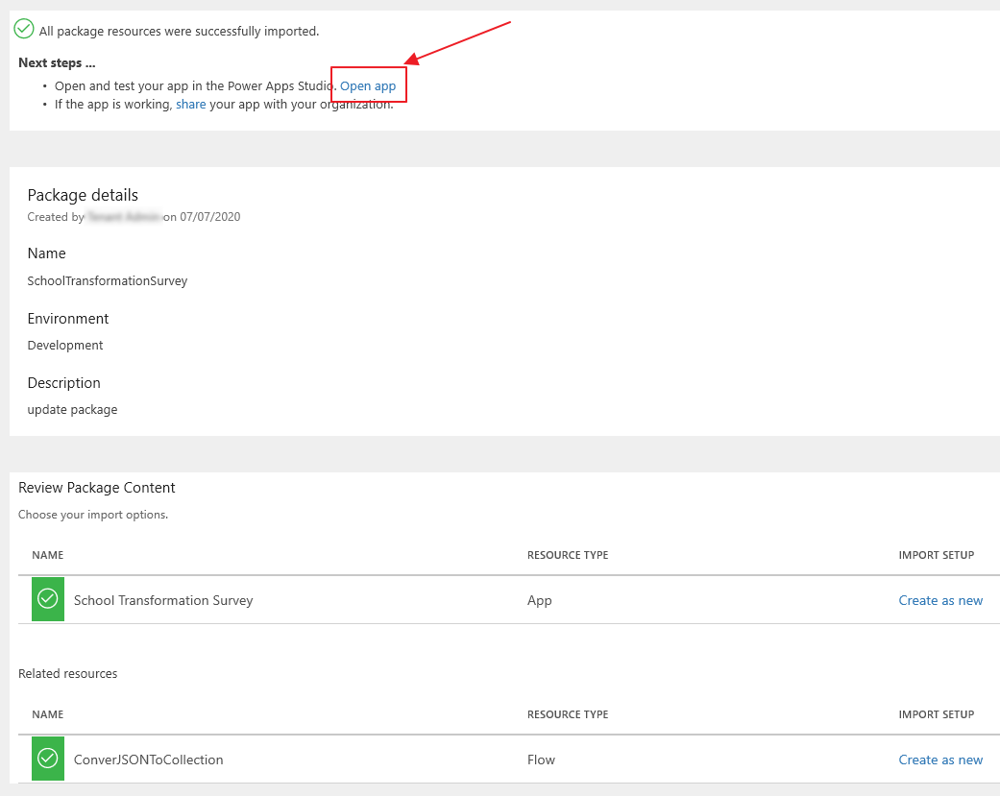
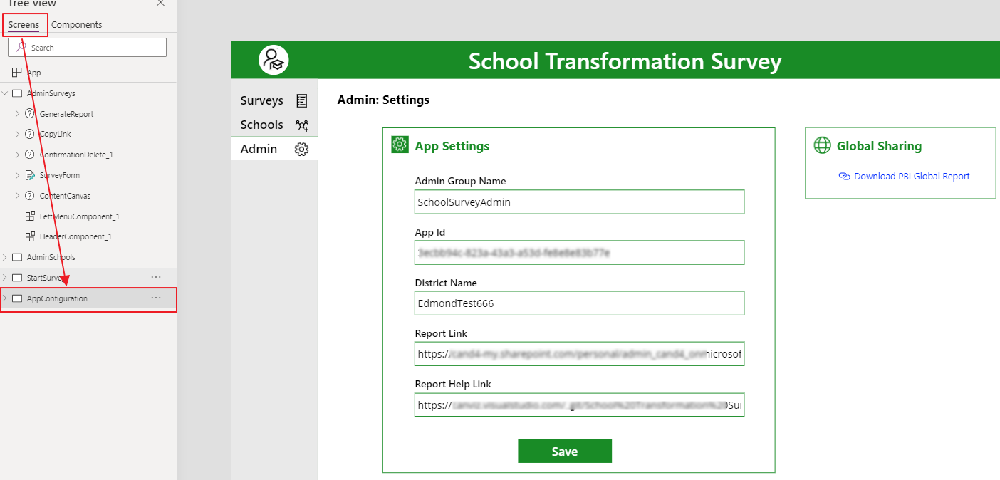
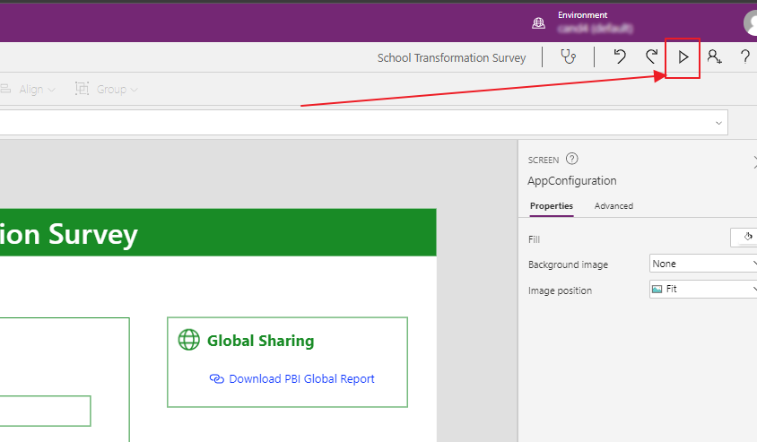
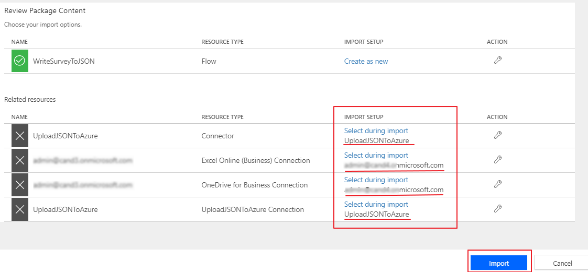
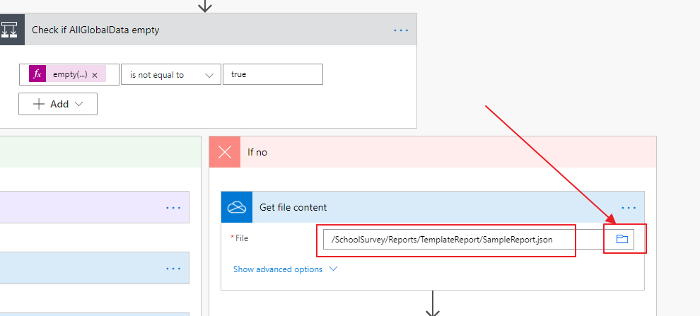
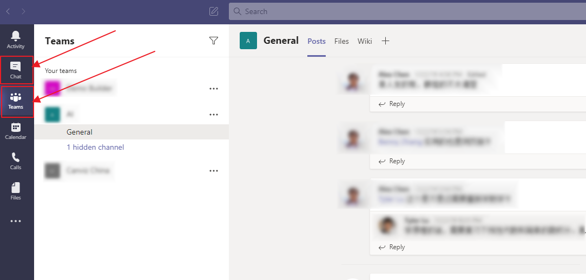
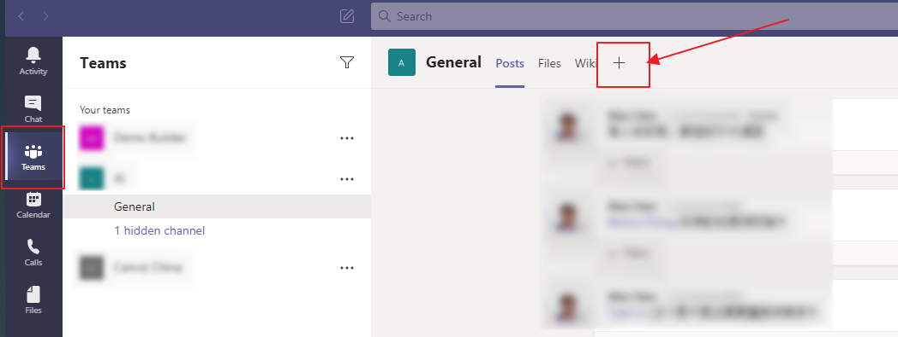

**NOTE:** These steps are ONLY for those who already have the School Transformation Survey deployed. If you haven't deployed STS at all, please go to [School Transformation Deployment Guide](https://github.com/MicrosoftEduIndustry/STS/blob/master/Document/School%20Survey%20Deployment%20Guide.md)

# Prerequisites

1. Previously installed School Transformation Survey.

2. Download the following items:

    | **Type** | **Name**                                                                                                                                                   | **Description**                                                                                                                         |
    | -------- | ---------------------------------------------------------------------------------------------------------------------------------------------------------- | --------------------------------------------------------------------------------------------------------------------------------------- |
    | Zip      | [SchoolTransformationSurvey.zip](https://github.com/MicrosoftEduIndustry/STS/blob/master/Packages/Hotfixes/SchoolTransformationSurvey.zip) | Download and leave zipped: Contains an app package and an Instant Flow which will need to be imported and configured in Power Automate. |
    | Zip      | [WriteSurveyToJSON.zip](https://github.com/MicrosoftEduIndustry/STS/blob/master/Packages/Hotfixes/WriteSurveyToJSON.zip)                   | Download and leave zipped: Contains a Scheduled Flow for the app that will need to be imported and configured in Power Automate.        |

# Import the Power App
This section will walk you through the required steps to deploy the updated solution files.

First, import the Power App by following steps.

1. In a web browser, open <https://make.powerapps.com> and go to **Apps**.

2. Click **Import canvas app**.

    

3. Browse to the **SchoolTransformationSurvery.zip** file in the project files
    you downloaded and select it, then click **Upload**.

    

    After a few moments, you’ll see the import package screen that looks like
    the one show below. Make sure there are two items in the package, one is the
    Power App, the other is the Flow which the Power App uses.

    

    > Since the solution is already existing in your environment, ensure the **IMPORT SETUP** value is set to **Update** for **BOTH** the
    Power App and Flow.

4. Now do the exact same thing in the Flow row in the list. In the **IMPORT
    SETUP** column, click **Update**.

    **Note:** Make sure both the App and Flow items in the package have the
    IMPORT STEP column value Create as new.

    

    Now the **Import** bottom should be enabled.

5. Click **Import**.

    

    Wait until the import is done. On the success page, click **Open app** to
    open the Power App in Edit Mode.

    

# Configure Connector Permissions

Next, you will need to configure the permissions for the connectors the Power
App uses to communicate with Azure Active Directory, Office 365 User Data, and
OneDrive for Business.

More details about the connectors:

**OneDrive for Business**: Connects to data source of the app in OneDrive folder
you created and uploaded files to at the beginning of this installation process
in the [Upload SchoolSurvey folder and files to
OneDrive](#upload-schoolsurvey-folder-and-files-to-onedrive) section.

**Azure AD**: Checks the membership of users in the Azure Active Directory
Security Group you created at the beginning of this installation process in the
[Create a security group in Azure](#create-a-security-group-in-azure) section.

**Office365Users**: Provides basic user profile information about the user.

You will see this screen appear.

If this is the first time you have opened the app (it should be) you will see
the following screen appear when you try to sign in.

1.  Select the **Consent on behalf of your organization checkbox**.

2.  Click **Accept**.

    

3.  Then, back in the screen that shows the 3 connectors, click **Allow**.

# Configure the App

Wait for a moments and you’ll see the edit interface.

1.  **Open Data sources panel**. There are multiple types of connections that
    the app uses, nine of them need to be **reconnected**, to the tables in the
    **Excel files** located in your OneDrive see below:

    

2.  **Remove** the nine data sources showed in previous step by **clicking
    ellipses** behind those nine, choose “Remove” in pop menu.

3.  Connect to OneDrive from Data sources panel under **“Connectors”** group,
    find **OneDrive for Business** from the group.

    **Click this connector**. The connection probably already exists, you just
    need to make sure the account in it is you logged in. If it is not you or
    there is no connection, click **“Add a connection”** and follow steps to add
    a new one.

    

    **Click the connection** in the fly out window then a new window will pop in
    from the right. All files of OneDrive are listed in it. **Find the root folder**
    you created for the app. (SchoolSurvey)

    

    Go to the folder, and select **“AppData”** in its folder list.

    

    Pictured below are the Excel files which hold the data sources for the app.

    

    You’ll need to add tables from those four Excels above to the app. For example,
    **select Schools.xlsx**.

    

    **Choose table** “AppConfig”**,** “Schools”, “Validates”, then **Connect**. You
    have now added three of nine data connections.

    Follow the **same steps as above** and add other tables from corresponding Excel
    files. The list of relationship of tables and Excel files are listed below.

    | Excel File         | Tables                                   |
    | ------------------ | ---------------------------------------- |
    | Schools.xlsx       | Schools, Validates, AppConfig            |
    | SurveyContent.xlsx | Questions, QuestionItems, QuestionGroups |
    | SurveyResults.xlsx | SurveyResults, GlobalSharedTime          |
    | Surveys.xlsx       | Surveys                                  |

4.  Open screen **Tree view** from left menus, select screen AppConfiguration.

    

    On the right corner of PowerApps Editor, click Preview icon.

    

    Set values for fields in screen AppConfiguration.

    \#1: **Admin Group Name**: Input admin group name you created when execute the
    script automate.ps1.

    \#2: **App Id:** Go to Apps list of PowerApps in your tenant, find the app you
    are editing and **click Details**.

    

    The App Id is shown as follows. Copy and paste it into the App Id field.

    

    \#3: **District Name:** Input the district name of school.

    \#4: **Report Link:** Go to OneDrive online, copy the link of Power BI template
    file, then paste the link in the field.

    

    \#5: **Report Help Link:** Copy and paste the link of [How to use Power
    BI](https://github.com/MicrosoftEduIndustry/STS/blob/master/Document/How%20to%20use%20PowerBI.md).

    Click **Save**, then exit preview mode.

# Save and publish the App

1.  Click **“File”** on the top menus in Edit interface of the app, then click
    **Save** on the left menu, optionally you can input version note for save
    and then **click Save**.

    

    Click **Publish**

    

    Click **“Publish this version”** in the pop window.

    

    The app is now ready to be used.

# Import the scheduled Flow

There are **two flow** in the app, one is an **Instant type**, the other is a
**Scheduled type**. The instant flow is packed into app’s package, the scheduled
one is not which means that you need to use the **zip package** to **import** it
into your environment.

1.  Open <https://flow.microsoft.com/> in a browser, sign in with you work
    account.

2.  Go to My Flows, **Click Import**.

    

3.  **Select the flow file** ”WriteSurveyToJSON.zip” from [project
    file](#prerequisites) , Upload.

    

4.  Make sure it looks like below:

    

5.  **Update connections** for Related resources in this flow.

6.  Click **“Select during import”** on each item, if there are already created
    connections that exist on the right pop up then select a connection with the
    same type as showed in Related resources list. **Click Save.**

    

    After all related resources connected, it should look like below:

    

    If no connections, Click **“Create new”** in a new tab of the browser, then
    follow the steps to create a new one. Once completed go to the previous tab and
    **Click Refresh list**, you’ll see the new connection you created.

    

7.  You should now see the following. **Click Import**.

    

8.  **Open flow**

    

# Configure the scheduled Flow

On Flow interface

1.  **Set time zone** in Recurrence.

    Recurrence-\>Edit-\>Show Advanced options, choose a time zone.

2.  **Initialize variable** for reports folder

    Value: input the path of “Reports” folder in OneDrive, for example,
    “/SchoolSurvey/Reports/”

3.  **Get Surveys** (Remove invalid information first)

    

    **Document Library**: OneDrive

    **File:** Select the path where you put Surveys.xlsx

    **Table:** Select “Surveys”

    **NOTE**: if you cannot select a table in the dropdown list, re-select the path
    of Surveys.xlsx by clicking the file icon in File.

4.  Get Report Configuration

    **Document Library**: OneDrive

    **File**: Select the path where you put SurveyResults.xlsx

    **Table**: Select “ReportConfiguration”

5.  Get Calculation Configuration

    **Document Library**: OneDrive

    **File**: Select the path where you put SurveyResults.xlsx

    **Table**: Select “CalculationConfiguration”

6.  Apply to each survey-\> Get a School Data

    **Document Library**: OneDrive

    **File**: Select the path where you put Schools.xlsx

    **Table**: Select “Schools”

7.  Get the Data of current Survey

    **Document Library**: OneDrive

    **File**: Select the path where you put SurveyResults.xlsx

    **Table**: Select “SurveyResults”

8.  Check if AllGlobalData empty-\>If yes -\>Update a row

    **Document Library**: OneDrive

    **File**: Select the path where you put SurveyResults.xlsx

    **Table**: Select “GlobalSharedTime”

    **Key Column**: Id

    **Key Value**: 1

9.  Check if AllGlobalData empty-\>If no -\> Get file content

    **File**: Select the path where you put SampleReport.json, it should like:
    /SchoolSurvey/Reports/TemplateReport/SampleReport.json

    **NOTE**: Although you would see the path correctly put in box, you’ll have to
    re-point it again by clicking the file icon in right side of the box.

    

10. Check if AllGlobalData empty-\>If no -\>Update a row2

    **Document Library**: OneDrive

    **File**: Select the path where you put SurveyResults.xlsx

    **Table**: Select “GlobalSharedTime”

    **Key Column**: Id

    **Key Value**: 1

11. **Save and Test the flow**. Make sure the flow runs successfully.

    

# How to embed the PowerBI report into Teams

1.  Open your Microsoft Teams app, click Teams or Chat from left tab bar.

    

2.  In a team screen or a chat screen, click add icon.

    

3.  In the prompt window, search then choose Power BI,

    

4.  In the Power BI prompt window, input a name for the tab you are adding,
    collapse the workspace which holds the report you are adding, then choose
    the report, click save.

    

5.  After clicking Save, you are gonna see a new tab added, and the report
    showed below the tab.

    Note: Make sure members in the team or the chat have permissions to access
    the report.

    
