Prerequisites
=============

1.  Download **Power BI Desktop**. If you have it make sure it’s the latest
    version.

    Power BI Desktop is hosted in **Microsoft Store**, launch Store, input
    “Power BI” in search box, find it in the search result. Install it in your
    machine.

    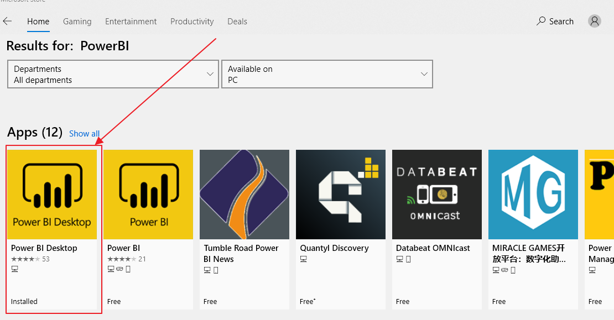

2.  Get the JSON file of the report you’ll use. Login to OneDrive, find the
    folder of the project, go to “**Reports**” folder. The “**District**” folder
    contains all surveys’ result of the whole district, and other folders is for
    each school.

    Download the json file you need.

Load JSON in Power BI Desktop
=============================

1.  Launch Power BI Desktop, and sign in your organizational account.

    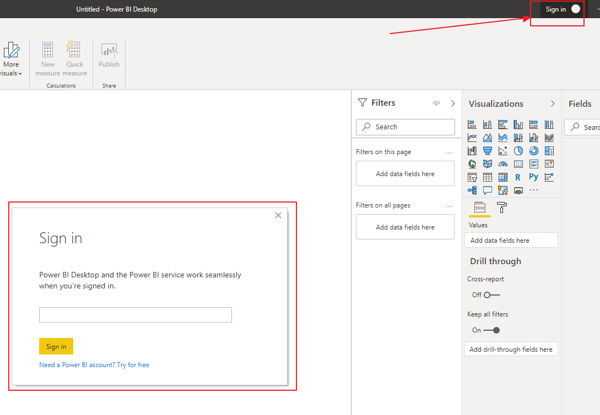

2.  Open **SchoolTransformationSurvey.pbix** in Power BI Desktop. You can get it
    from the GitHub.

3.  You’ll see pages and reports, its source is sample data, you need to change
    the data source to the json file you got in [Prerequisites
    \#2](#prerequisites) .

    From the menu list in Power BI Desktop, click the chevron beside **Transform
    data**, you’ll see a pop up, click **Data source settings**.

    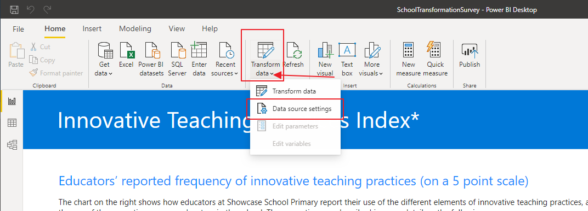

4.  In Data source settings, click “**Change source**…”

    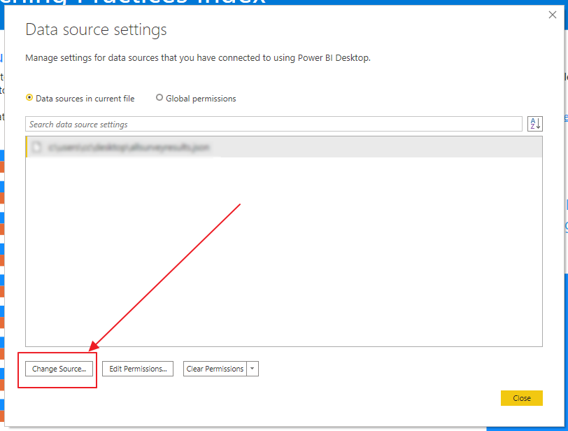

5.  In JSON pop up, click Browse to select JSON file, keep Open file as Json,
    click Ok, you’ll see the file listed in Data source settings, then click
    Close.

    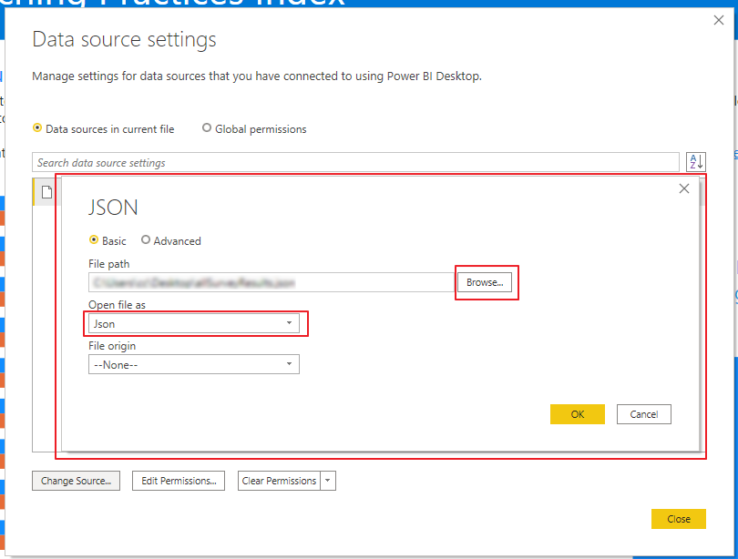

    You may encounter this message after closing data source settings, just
    click **Apply changes**, and wait for a few minutes let applying done.
    You’ll see updated report.

    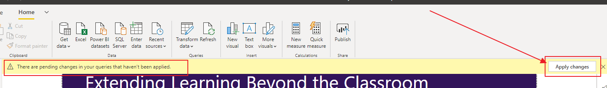

Create workspace for displaying and sharing reports
===================================================

1.  After reports showed correctly, you can start to publish and share reports
    to others. Before publish reports, you need a workspace in Power BI site,
    login <https://app.powerbi.com/> using your organizational account.

2.  From menus in the left click Workspaces, and click Create a workspace in the
    right pop up. Input a name for workspace and save it. Remember the name for
    next steps.

    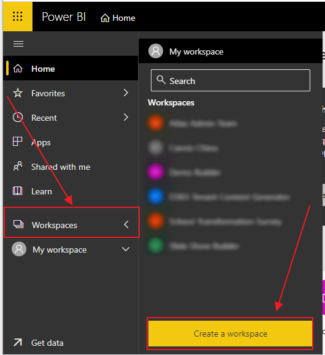

Publish reports
===============

1.  Go back to Power BI Desktop, Click **Publish** in top menus, select the
    workspace you created in previous step, then click Select.

    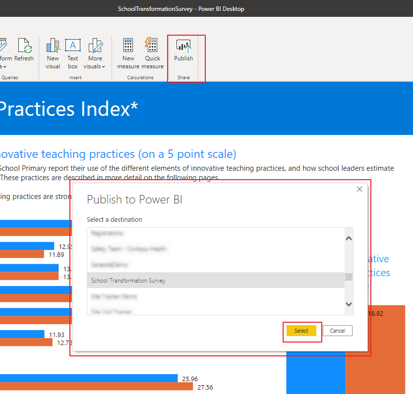

    Wait for a few minutes until publishing done.

Share reports
=============

1.  Go to <https://app.powerbi.com/> , open the workspace you created. Click
    Reports in your workspace.

    You’ll find the report you published from Power BI Desktop.

    

2.  Click share icon under ACTIONS of the report to share report.

    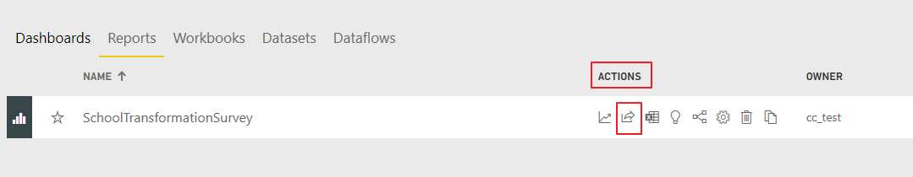

3.  Grant access with emails, input user’s email under your organizational
    tenant in box\#1. If you don’t want recipients share your reports or build
    new content, please remember **uncheck** items in \#2.

    Then click Share. User will receive a email with report link \#3.

    Note: If the user you share to is a guest in your tenant, the user cannot
    re-share the report even you grant re-share to him. As a guest user, only
    Read-Only access.

    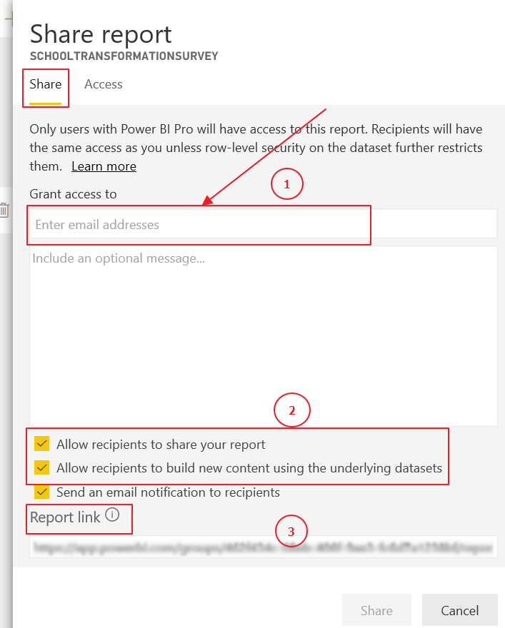

Manage permissions of accessing reports
=======================================

1.  After granting access to users, you may want to change their permission.
    Open the pop up Share report, Click Access, you’ll see everyone’s access,
    click the ellipses behind ACCESS, choose the permission you want to set.

    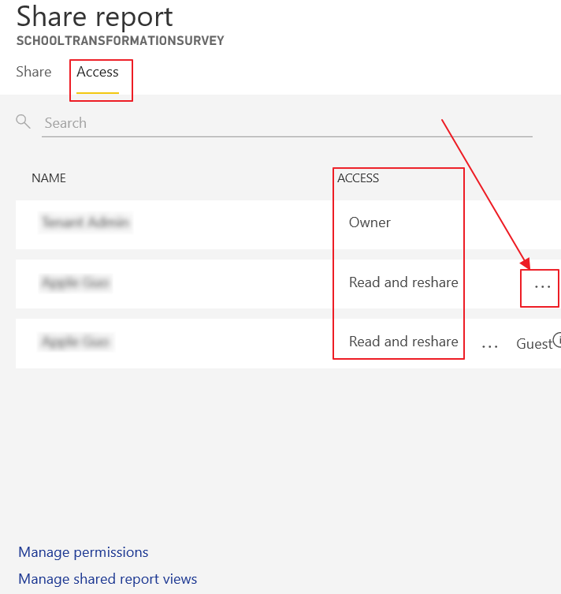

Export report PDF from Power BI
===============================

After you load survey data to Power BI Desktop successfully, you can export all
reports to a PDF.

1.  Open **SchoolTransformationSurvey.pbix** in Power BI Desktop, Click
    “**File**” from top menu list, click “**Export**” from pop up menu, then
    click “**Export to PDF**”.

    Wait for a few minutes, this procedure will generate **all reports** to a
    PDF file.

    The PDF file will be opened in Browser.

    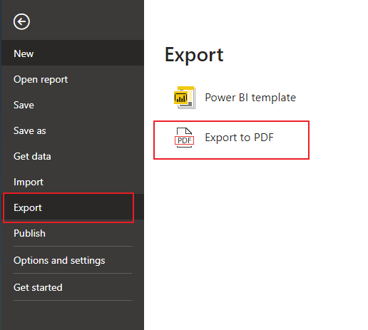
