Prerequisites
=============

1. A Microsoft 365 account with the following services:

    * OneDrive for Business
    * Power Apps
    * Power BI (Free for personal workspace or Pro for shared workspaces and dashboards)
    * Power BI Desktop installed  
  
  
2. An Azure subscription

3. Download the following items:

| **Type**| **Name**                      | **Description**                                                            |
|--------|--------------------------------|----------------------------------------------------------------------------|
| Folder | SchoolSurvey                   | This folder and the contents need to be uploaded to OneDrive. |
| Zip    | SchoolTransformationSurvey.zip | Contains an app package and an Instant Flow which will need to be imported and configured in Power Automate.             |
| Zip    | WriteSurveyToJSON.zip          | Contains a Scheduled Flow for the app that will need to be imported and configured in Power Automate.                 |
| Zip    | CopyTextSolution.zip           | A customized component that implements the copy to clipboard feature.                     |

Upload SchoolSurvey folder and files to OneDrive
================================================

Follow the steps below to upload the necessary files to OneDrive:

1.  Login to **OneDrive** and select **My files** ensuring you are seeing **Files**.

    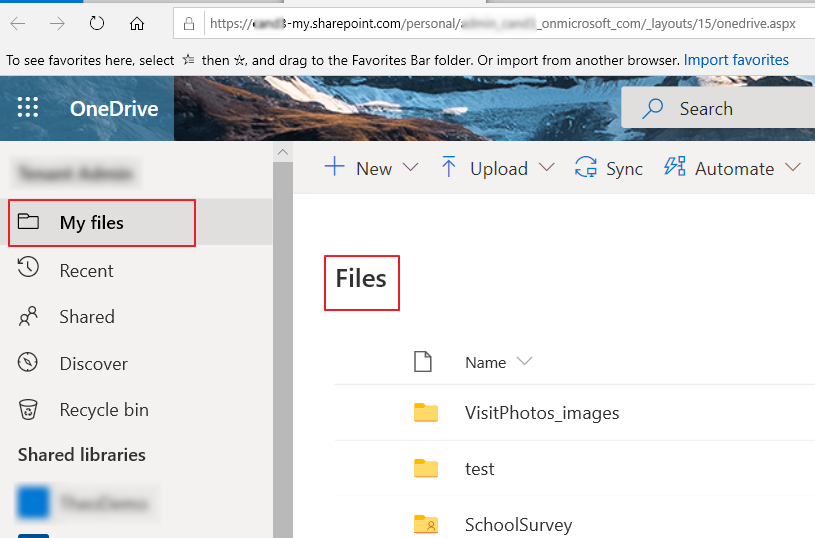

2.  Now create the SchoolSurvey root folder. Click on **New** > **Folder**.

    

3. Name the folder **SchoolSurvey** and click **Create**.

    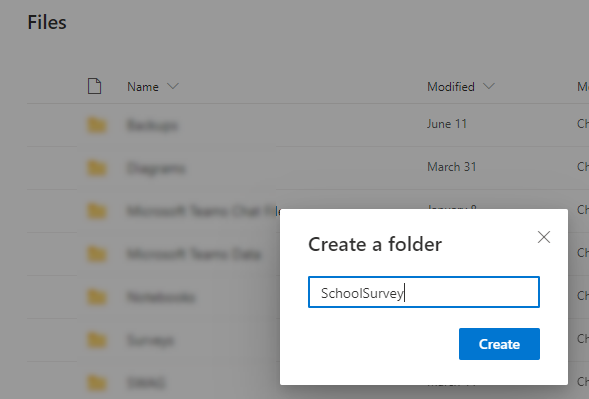

4.  Now it's time to upload the AppData folder with the files. Click the chevron next to **Upload** and choose **Folder**.

    
    
5.  Browse to the **SchoolSurvey** folder where you downloaded and extracted for this project.  Select the **AppData** subfolder, then click **Select Folder**.

    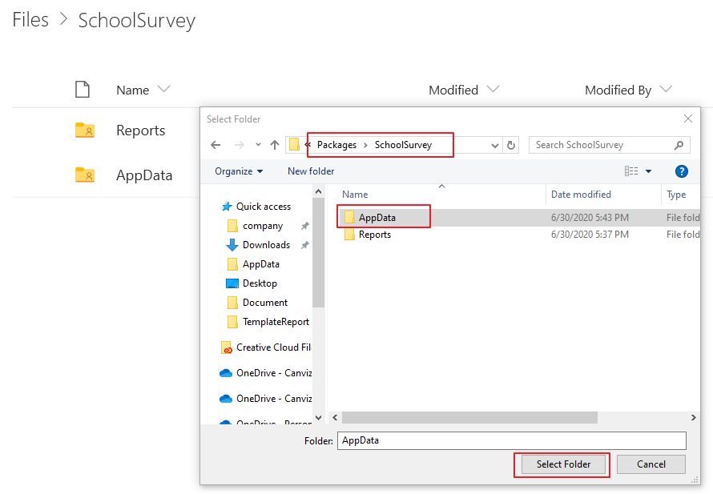

6.  When the upload is done, open the **AppData** folder and verify the files have been uploaded.

7.  Navigate back up to the **SchoolSurvey** root folder and create a new folder called **Reports**.

8.  Open the **Reports** folder and create two more folders under it, one named **District** and the other named **TemplateReport**.

9.  Open the **TemplateReport** folder and upload the Power BI template file (**SchoolTransformationSurvey.pbix**) and JSON file (**SampleReport.json**).

    These files are located in the **Packages/SchoolSurvey/Reports/TemplateReport** folder in the project files.

    When you are all done the folder structure and files in the folders will look like this:

    

    > **Note:** Record the path of the files that you created and uploaded, you will need the paths in subsequent steps.

Create a security group in Azure 
=================================

Next, create an Azure Active Directory Security Group for the administrators of the app.

1.  Login to the Azure portal. <https://portal.azure.com>

1.  Select **Azure Active Directory**.

    

1.  Select **Groups**, then click **+ New group**.

    

    

1.  Set **Group type** to **Security**.
1.  In the **Group name**. textbox, enter SchoolSurveyAdmin.

    >**Note:** If you change the Group name to be something other than SchoolSurveyAdmin you’ll have to update it in Power App.

1. Add a description if you like.
1. You can also add members to this group in this dialog or add them after the group is created.

    

1.  Add members to the group you created. If you didn’t add members when you created the group, or if you need to add new members in the future, follow these steps.

1.  Go to the group list, search and find the group, select the group, and finally, click **Members**.

    

1.  Click **+ Add members**, then search for and select a member in your organization to add.

    

1.  Click **Select** to add them to the group.

Enable the Power Apps component framework
=====================================

Now, turn on the ability for the Power Apps in the environment to run Power Apps Component framework controls.

1.  In a web browser, open <https://web.powerapps.com>.

1.  Click the settings icon and select **Admin center**.

    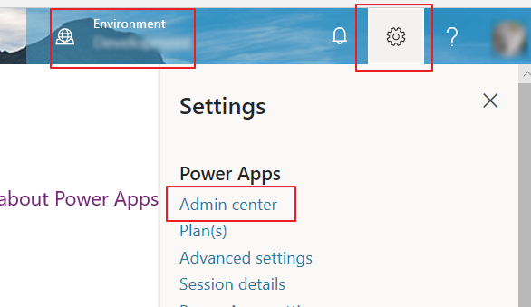

1.  In the Environment list, go to settings page for the target environment where you wish to deploy the Power App.

    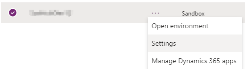

1.  Go to **Product** \> **Features**.

1.  Turn on the **Power Apps component framework for canvas apps**, then click **Save**.

    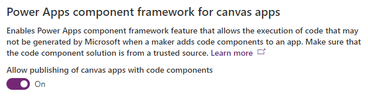

Import CopyToClipboard component
================================

Next, import the custom PCF component that implements the copy to clipboard functionality.

1.  In a web browser, open <https://make.powerapps.com> and go to **Solutions**.

1.  Click **Import**.

    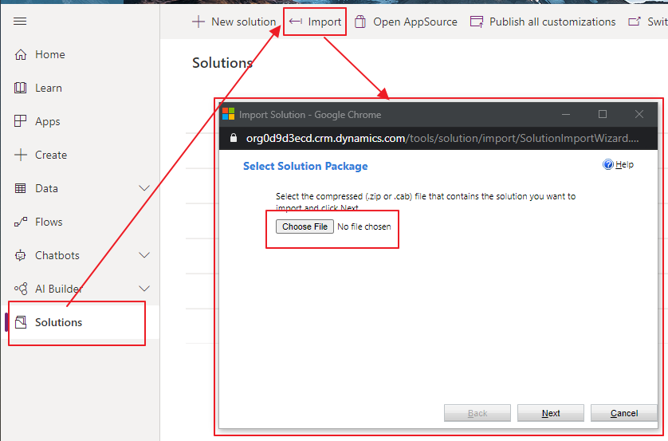

1.  Choose the file named **CopyTextSolution.zip** in the project files you downloaded, then click **Next**.

    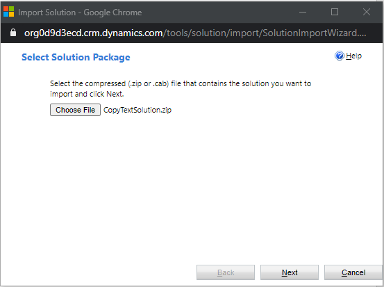

1.  Click **Import**.

    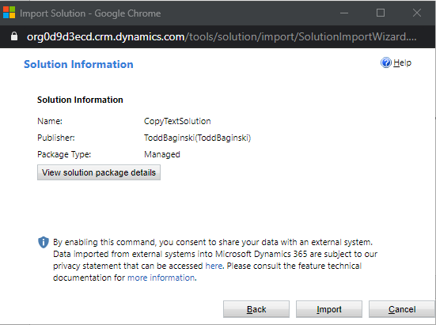

1.  Click **Close**.

    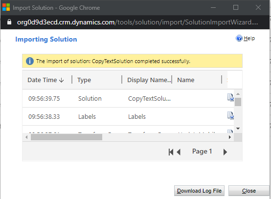

Import the Power App
====================================

Next, install the Power App in the target environment.

1.  In a web browser, open <https://make.powerapps.com> and go to **Apps**.

1.  Click **Import canvas app**.

    

1.  Browse to the **SchoolTransformationSurvery.zip** file in the project files you downloaded and select it, then click **Upload**.

    

    After a few moments, you’ll see the import package screen that looks like the one show below. Make sure there are two items in the package, one is the Power App, the other is the Flow which the Power App uses.

    

    Since this package is new to your environment, the **IMPORT SETUP** value needs to be changed from **Update** to **Create as new** for **BOTH** the Power App and Flow.
    
1.  In the App row in the list, in the **IMPORT SETUP** column, click **Update**. Then, in the popup panel, select **Create as new** and click **Save**. (See the screenshot below for more details.)

1.  Now do the exact same thing in the Flow row in the list, in the **IMPORT SETUP** column, click **Update**. Then, in the popup panel, select **Create as new** and click **Save**.
    
    >**Note: ** Make sure both the App and Flow items in the package have the IMPORT STEP column value Create as new.

    

    Now the **Import** bottom should be enabled.  
    
1.  Click **Import**.

    

    Wait until the import is done.  On the success page, click **Open app** to open the Power App in Edit Mode.

    

1.  When this prompt appears, click **Open app**.  This prompt is referring to the copy to clipboard component in the Power App that allows users to click a button and copy the data from the Power App to their clipboard.  This button does not provide access to read from the clipboard.  This is a standard prompt that appears anytime a Power App uses a custom Power Apps PCF Control, no matter what the control does.

    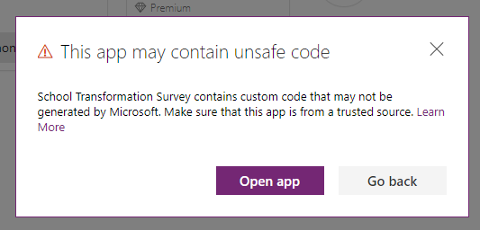

    Click **Update**.

    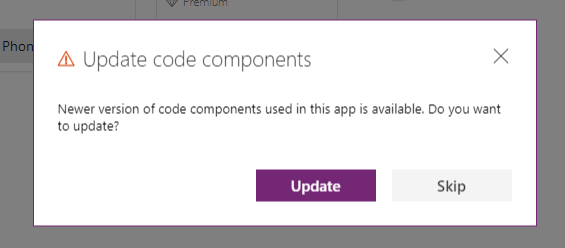

Configure Connector Permissions
===============================

Next, you will need to configure the permissions for the connectors the Power App uses to communicate with Azure Active Directory, Office 365 User Data, and OneDrive for Business.

More details about the connectors:

**OneDrive for Business**: Connects to data source of the app in OneDrive folder you created and uploaded files to at the beginning of this installation process in the [Upload SchoolSurvey folder and files to OneDrive](#upload-schoolsurvey-folder-and-files-to-onedrive) section.

**Azure AD**: Checks the membership of users in the Azure Active Directory Security Group you created at the beginning of this installation process in the [Create a security group in Azure ](#create-a-security-group-in-azure) section.

**Office365Users**: Provides basic user profile information about the user.

You will see this screen appear.

If this is the first time you have opened the app (it should be) you will see the following screen appear when you try to sign in. 

1. Select the **Consent on behalf of your organization checkbox**.
1. Click **Accept**.

1. Then, back in the screen that shows the 3 connectors, click **Allow**.

Configure the App
=================

Wait for a moments and you’ll see the edit interface.

1.  Open screen **Tree view** from left menus.

    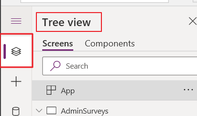

>   Set values for global variables.

Select **“App”**, In formula bar, select **“OnStart”**, then stretch the fx input area like below.

There are five variables that need to be set, input the proper value in double quotes.

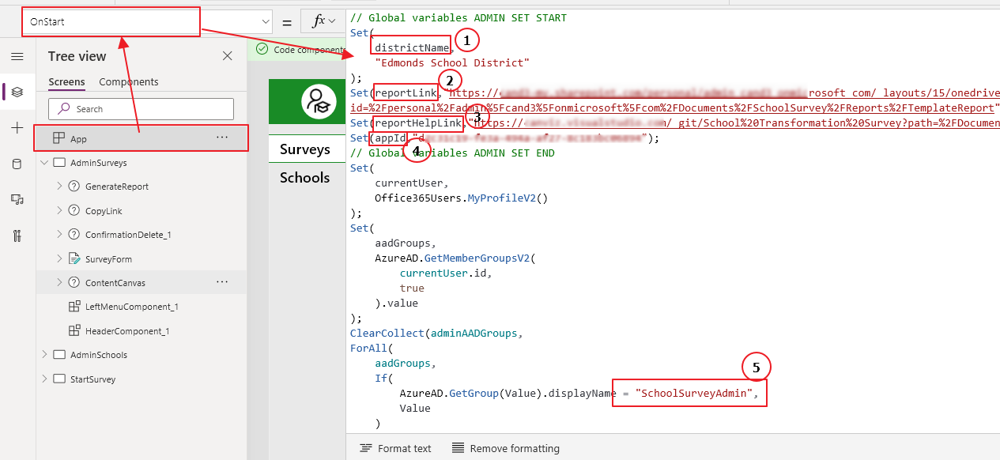

\#1: **districtName:** Input the district name of school.

\#2: **reportLink:** Go to OneDrive online, copy the link of Power BI template
file, then paste the link as the value of reportLink.

\#3: **reportHelpLink:** Copy and paste the link of [How to use Power
BI](https://canviz.visualstudio.com/_git/School%20Transformation%20Survey?path=%2FDocument%2FHow%20to%20use%20PowerBI.md).

\#4: **appId:** Go to Apps list of PowerApps in your tenant, find the app you are editing and **click
Details**.

The appId is shown as follows. Copy and paste it into the appId variable in the app.

\#5: **Name of admin group**: If you created the admin group using the name
“SchoolSurveyAdmin”, you can skip this step, if not, update this section with the admin group name you created.

1.  Go back to the app, **Open Data sources panel**. There are multiple types of
    connections that the app uses, seven of them need to be **re-connected**,
    to the tables in the **Excel files** located in your OneDrive see below:

    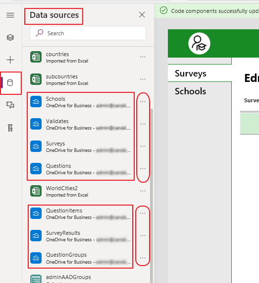

2.  **Remove** the seven data sources showed in previous step by **clicking ellipses**
    behind those seven, choose “Remove” in pop menu.

3.  Connect to OneDrive from Data sources panel under **“Connectors”** group, find
    **OneDrive for Business** from the group.

    **Click this connector**. The connection probably already exists,
    you just need to make sure the account in it is you logged in. If it is not you or there is no connection, click
    **“Add a connection”** and follow steps to add a new one.

    

    **Click the connection** in the fly out window then a new window will pop in from the right. All
    files of OneDrive are listed in it. **Find the root folder** you created for the
    app. (SchoolSurvey)

    

    Go to the folder, and select **“AppData”** in its folder list.

    

    Pictured below are the Excel files which hold the data sources for the app.

    

    You’ll need to add tables from those four Excels above to the app. For
    example, **select Schools.xlsx**.

    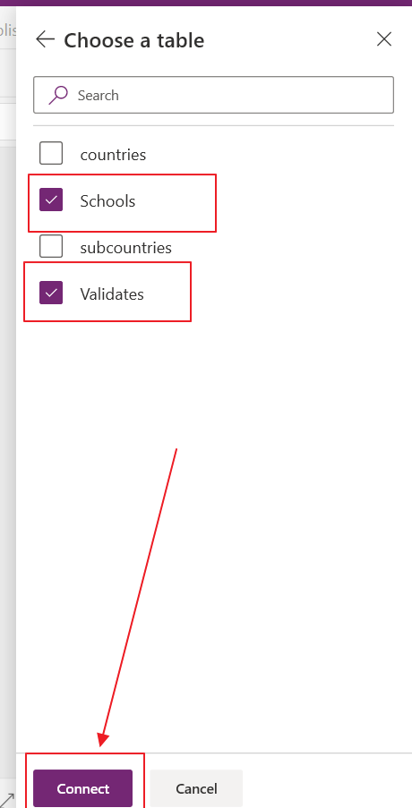

    **Choose table** “Schools”, “Validates”, then **Connect**. You have now added two of seven data connections.

    Follow the **same steps as above** and add other tables from corresponding Excel
    files. The list of relationship of tables and Excel files are listed below.

| Excel File         | Tables                                   |
|--------------------|------------------------------------------|
| Schools.xlsx       | Schools, Validates                       |
| SurveyContent.xlsx | Questions, QuestionItems, QuestionGroups |
| SurveyResults.xlsx | SurveyResults                            |
| Surveys.xlsx       | Surveys                                  |

Save and publish the App
========================

1.  Click **“File”** on the top menus in Edit interface of the app, then click **Save**
    on the left menu, optionally you can input version note for save and then **click Save**.

    

    Click **Publish**

    

    Click **“Publish this version”** in the pop window.

    

    The app is now ready to be used.

Import the scheduled Flow 
==========================

There are **two flow** in the app, one is an **Instant type**, the other is a **Scheduled
type**. The instant flow is packed into app’s package, the scheduled one is not which means that 
you need to use the **zip package** to **import** it into your environment.

1.  Open <https://flow.microsoft.com/> in a browser, sign in with you work
    account.

2.  Go to My Flows, **Click Import**.

    

3.  **Select the flow file** ”WriteSurveyToJSON.zip” from [project
    file](#prerequisites) , Upload.

    

4.  Make sure it looks like below:

    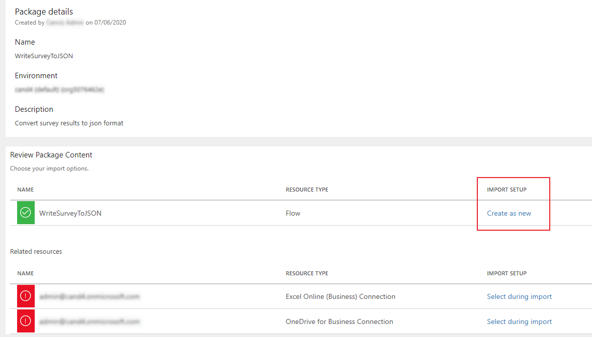

5.  **Update connections** for Related resources in this flow.

    Click **“Select during import”** on each item, if there are already created connections that exist
    on the right pop up then select a connection with the same type as showed in Related
    resources list. **Click Save.**

    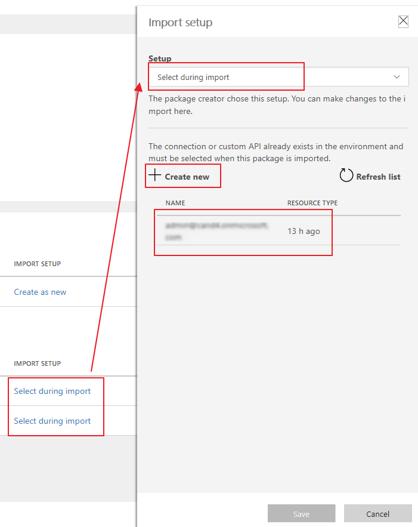

    If no connections, Click **“Create new”** in a new tab of the browser, then follow the steps
    to create a new one. Once comlpeted go to the previous tab and **Click Refresh list**, you’ll see
    the new connection you created.

    

6.  You should now see the folling. **Click Import**.

    

7.  **Open flow**

    

Configure the scheduled Flow
============================

On Flow interface

1.  **Set time zone** in Recurrence.

    Recurrence-\>Edit-\>Show Advanced options, choose a time zone.

2.  **Initialize variable** for reports folder

    Value: input the path of “Reports” folder in OneDrive, for example,
    “/SchoolSurvey/Reports/”

3.  **Get Surveys** (Remove invalid information first)

    

    )

    **Document Library**: OneDrive

    **File:** Select the path where you put Surveys.xlsx

    **Table:** Select “Surveys”

    > NOTE: if you cannot select a table in the dropdown list, re-select the path
    > of Surveys.xlsx by clicking the file icon in File.

4.  Get Report Configuration

    **Document Library**: OneDrive

    **File**: Select the path where you put SurveyResults.xlsx

    **Table**: Select “ReportConfiguration”

5.  Get Calculation Configuration

    **Document Library**: OneDrive

    **File**: Select the path where you put SurveyResults.xlsx

    **Table**: Select “CalculationConfiguration”

6.  Apply to each survey-\> Get a School Data

    **Document Library**: OneDrive

    **File**: Select the path where you put Schools.xlsx

    **Table**: Select “Schools”

7.  Get the Data of current Survey

    **Document Library**: OneDrive

    **File**: Select the path where you put SurveyResults.xlsx

    **Table**: Select “SurveyResults”

8.  **Save and Test the flow**. Make sure the flow runs successfully. 

    

Share the app and its data source
=================================

You need to share the app and its data source to someone who want to access the
app.

1.  Share the app

    Open the pop menus of your app, **click Share** to open Share panel.

    

    In the Share panel, search and choose a member of your tenant, then **click Share**.

    Do not set non IT staff as co-owners.

    

2.  Share data source of the app

    Go to **OneDrive folder** of the app, hover on **AppData**, make share icon showed
    then click it.

    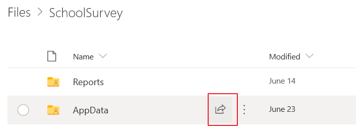

    **Click right arrow** in Send Link window, next choose **“People in [your tenant]
    with the link”** or **“Specific people”**, then click Apply. Lastly search and
    choose a member of your tenant and **click Send**.

    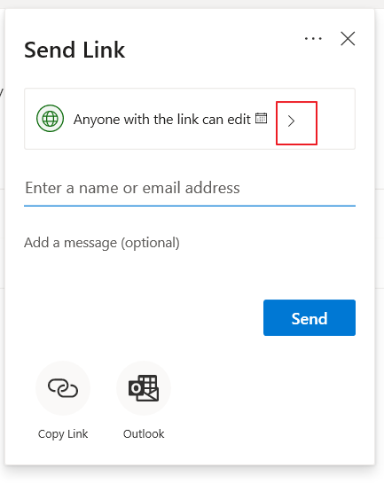

    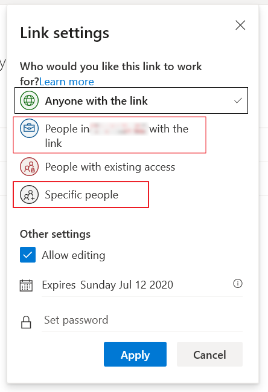

    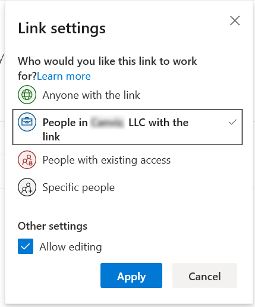

    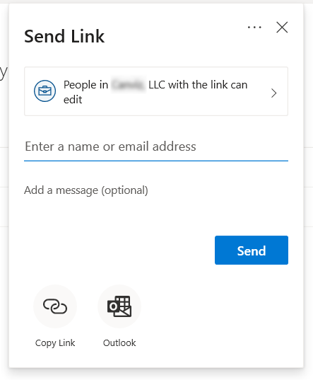
