Installation Click through Demo
=============
After you have all the solution files downloaded, you can use this guided demo to help with the steps: 
[Installation Demo](https://nam06.safelinks.protection.outlook.com/?url=https%3A%2F%2Fdemobuilderwebcpptxz.blob.core.windows.net%2Fschool-transformation-survey-deployment-guide%2Fstartdemo.html%3Fot%3Dfalse%26lan%3D%26guidemodeenabled%3Dfalse%26audioenabled%3Dfalse&data=02%7C01%7Cv-cwheel%40microsoft.com%7C53aba7e7cd8b4c1f032808d866602f43%7C72f988bf86f141af91ab2d7cd011db47%7C1%7C0%7C637371910584893550&sdata=JwA3FcYJwYBDPZO5pWDfDgENw7JDAODT0kQbVPxXXqQ%3D&reserved=0)

Prerequisites
=============

## M365 Accounts and Subscriptions

1.  A Microsoft 365 account with the following services:

    - SharePoint Client Components *(only needed if using PowerShell option included in steps)*
  
    - Windows PowerShell *(only needed if using PowerShell option included in steps)*
  
    - OneDrive for Business *(included in your O365 EDU subscription)*
  
    - Power Apps *(included in your O365 EDU subscription)*
  
    - Power Automate *(included in your O365 EDU subscription)*
  
    - Power BI *(free for personal workspace or Pro for shared workspaces and dashboards)*
  
    - Power BI Desktop *(free to install)*

2.  An Azure subscription

## Solution Files
3.  Download the following items:

    | **Type** | **Name**                                                                                                                                                   | **Description**                                                                                                                            |
    |----------|------------------------------------------------------------------------------------------------------------------------------------------------------------|--------------------------------------------------------------------------------------------------------------------------------------------|
    | Zip      | [OneDriveContainer.zip](https://github.com/MicrosoftEduIndustry/STS/raw/master/Packages/OneDriveContainer.zip)                   | This zipped file contains a SchoolSurvey folder with subfolders and files used for the Power App. The SchoolSurvey folder and all it's contents will need to be unzipped and uploaded to OneDrive.  **Instructions:** Download and extract zipped files. **Click** on filename to download.                    |
    | Zip      | [SchoolTransformationSurvey.zip](https://github.com/MicrosoftEduIndustry/STS/raw/master/Packages/SchoolTransformationSurvey.zip) | Contains an app package and an Instant Flow which will need to be imported and configured in Power Automate.  **Instructions:** Download and leave files zipped. **Click** on filename to download.   |
    | Zip      | [WriteSurveyToJSON.zip](https://github.com/MicrosoftEduIndustry/STS/raw/master/Packages/WriteSurveyToJSON.zip)                   | Contains a Scheduled Flow for the app that will need to be imported and configured in Power Automate.   **Instructions:** Download and leave files zipped. **Click** on filename to download.           |
    | Script   | [automate.ps1](https://github.com/MicrosoftEduIndustry/STS/raw/master/Packages/automate.ps1)                                     | Power Shell script which is executed to complete uploading files in OneDriveContainer to OneDrive and creating security group for the app.  **Instructions:** Download file. **Right-click** > **Save link as** on filename to download.   |
    | Script   | [UploadJSONToAzure.swagger.json](https://github.com/MicrosoftEduIndustry/STS/raw/master/Packages/UploadJSONToAzure.swagger.json) | A json file which will be used for creating a custom connector for uploading Global shared data to your Azure website.  **Instructions:** Download file. **Right-click** > **Save link as** on filename to download.                       |

---

 Step 01: OneDrive Files & Azure AD Group Creation
====================

OneDrive Files & Azure AD Group Installation Options
---------------

Before you can install the Power App and Flow solution you will need to upload files to OneDrive for Business and setup an Azure AD security group. 

There are two different ways you can do this:

1. [Option 1 - PowerShell method](https://github.com/MicrosoftEduIndustry/STS/blob/master/Document/School%20Survey%20Deployment%20Guide.md#-option-1---powershell-method-execute-powershell-script)
2. [Option 2 - Manual method](https://github.com/MicrosoftEduIndustry/STS/blob/master/Document/School%20Survey%20Deployment%20Guide.md#-option-2---manual-method-upload-files--create-azure-ad-group)

**NOTE:** No matter which method you choose to use please ensure you unzipped the **OneDriveContainer.zip** folder you downloaded in the prerequisites solution files steps.

---

 Option 1 - PowerShell method: Execute PowerShell script
---------------

Follow the steps below to upload the necessary files to OneDrive and create a
security group for the app using the PowerShell method.

1.  Download [SharePoint Online Client
    Components](https://www.microsoft.com/en-us/download/details.aspx?id=42038).
    In the download prompt page, choose the one similar to the screenshot below and click **Next** to download the file.

    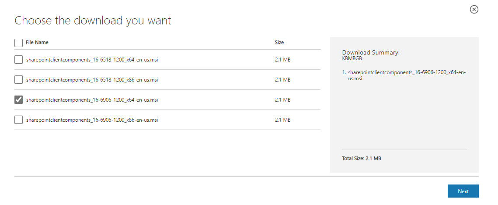

2.  Run the installer you downloaded. Once you have installed the downloaded
    setup, you can proceed next steps.

3.  Open **automate.ps1** using Notepad or VS Code (recommended).

4.  Replace values of variables in the beginning of the script file which are in
    between "Initialize variables start" and "Initialize variables end". 
    
    **NOTE:** Here is an example for these values:

    | Variable         | Value                                                              |
    |------------------|--------------------------------------------------------------------|
    | \$LocalFolder    | C:\\\\Package\\OneDriveContainer                                   |
    | \$AdminAccount   | admin\@dodo.onmicrosoft.com                                        |
    | \$AdminPass      | 12345678                                                           |
    | \$OneDriveURL    | https://dodo-my.sharepoint.com/personal/admin_dodo_onmicrosoft_com |
    | \$GroupName      | SchoolSurveyAdmin                                                  |
    | \$MembersInGroup | <abc@dodo.onmicrosoft.com>, <edf@dodo.onmicrosoft.com>             |

5.  Save the script file. Find and right click **Windows Powershell** on your
    computer and choose **Run as Administrator**.

6.  Navigate to the folder which you dpwnloaded the **automate.ps1** using the **`cd`** command similar to the screenshot below:

    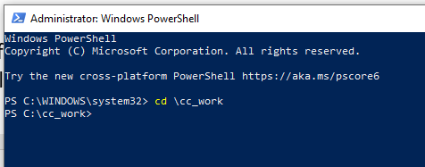

    Then execute the script file by typing **`.\\automate.ps1`** and hit enter.

    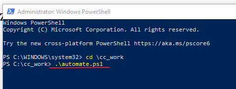

    During the script executing, you should see something similar to below:

    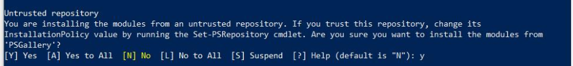

    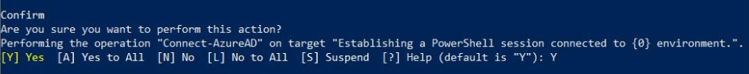

    For both messages, enter **`Y`** or **`y`** to proceed.

    > **NOTE:** You may encounter this error below when executing the script.

    > 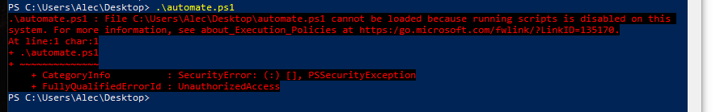

    > This is a security measure in PowerShell to prevent malicious scripts from
    running and potentially harming the system. Of course the script you are running
    will not harm your system. To fix it, please execute the script below to change
    the execution policy in PowerShell.

    > **Set-ExecutionPolicy RemoteSigned -Scope LocalMachine**

    > 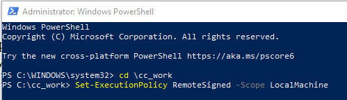

7.  To check scripts ran successfully. Login to **OneDrive** from the browser. 

    > Check if the files have
    uploaded under root directory and the file structure is same as what was in the files you downloaded in the
    OneDriveContainer folder.

8.  Login to **Azure** by going to <https://portal.azure.com> in the browser.

9. Navigate to **Azure Active Directory** > **Groups** and check if the group
    has been created and members added.

    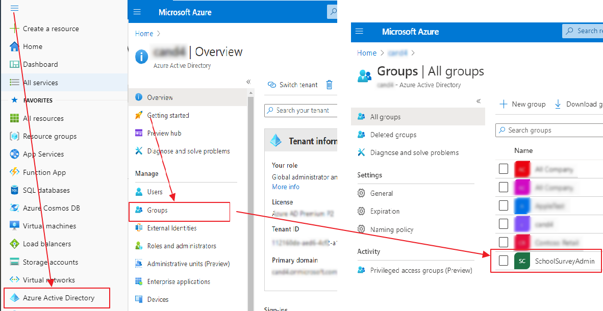

    If you want to add more members to the group, navigate to the group detail
    page.

    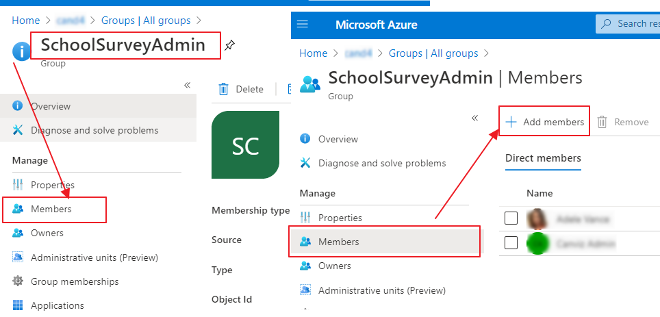

---

 Option 2 - Manual method: Upload files & create Azure AD group
---------------
Please follow the steps below to upload the files manually to OneDrive for Business and to create an Azure AD security group.

### Upload files to OneDrive for Business
 
1. Login to **Office.com** <https://www.office.com> and navigate to **OneDrive**. 

1. Select **My files** ensuring you are seeing **Files**.

    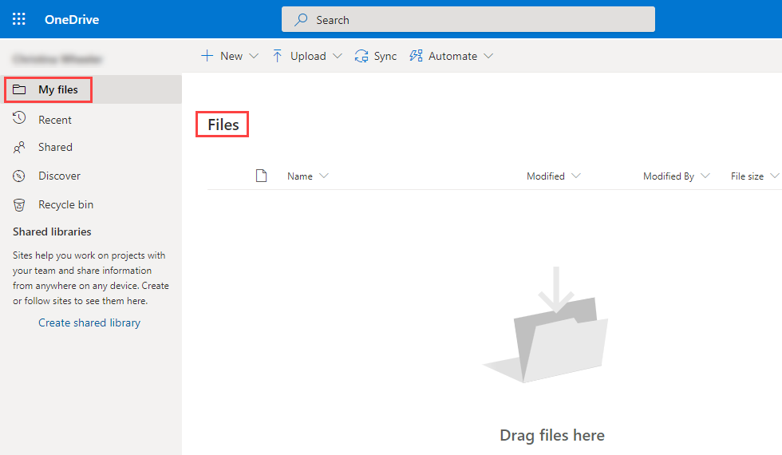

2.  Now upload the SchoolSurvey root folder to OneDrive. Click on **Upload** > **Folder**.

    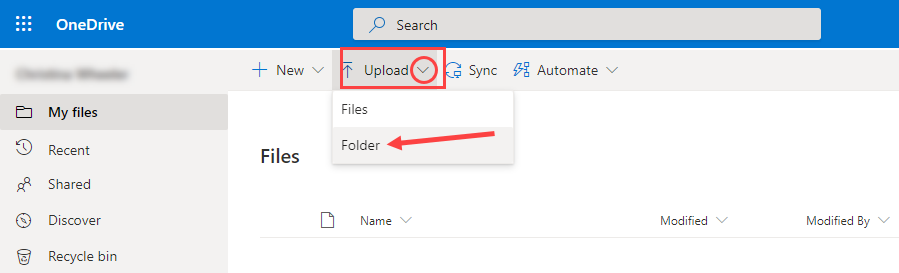
    
3.  Browse to the **SchoolSurvey** folder where you downloaded and extracted for this project.  Select the **SchoolSurvey** subfolder, then click **Upload**.

    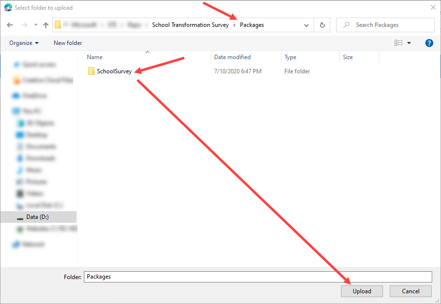

4. When prompted to confirm uploading of files, click **Upload**.

    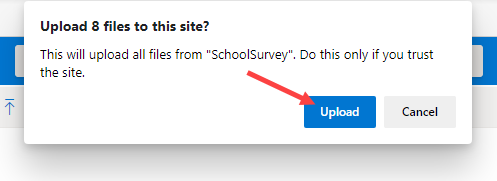

5.  When the upload is done, open the **SchoolSurvey** folder and verify the files and folders have been uploaded. The folder structure and files in the folders will look like this:

    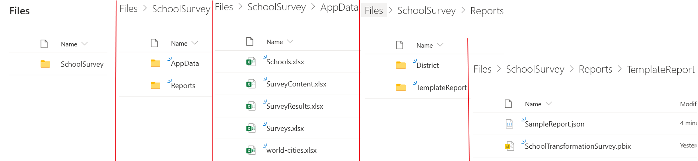

    **NOTE:** If the file structure doesn’t look like this or if you are having issues uploading the entire folder with subfolders, please create the folders and upload/move files to match this structure. 

### Create Azure AD Security Group
1.  Login to the **Azure** portal. <https://portal.azure.com>

2.  Select **Azure Active Directory**.

    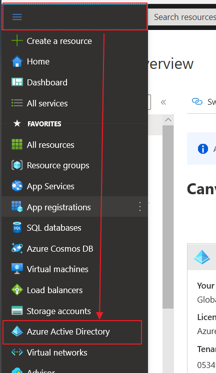

3.  Select **Groups**, then click **+ New group**.

    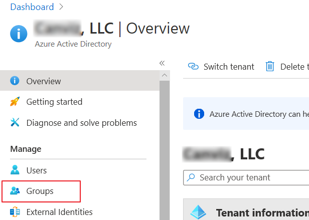

    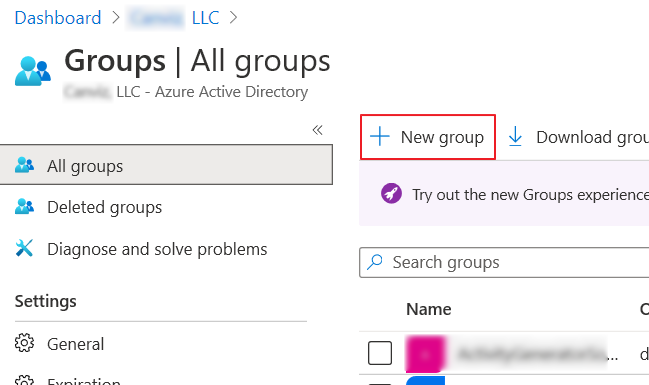

4.  Set **Group type** to **Security**.

5.  In the **Group name** textbox, enter **SchoolSurveyAdmin**.

    > **NOTE:** If you change the Group name to be something other than
    SchoolSurveyAdmin you’ll have to update it in Power App. Therefore we advise you set it as SchoolSurveyAdmin.

6.  Add an optional **description** if preferred.

7.  You can add members to this group in this dialog or add them after the
    group is created. To add members to this group, click on **No members selected**.

    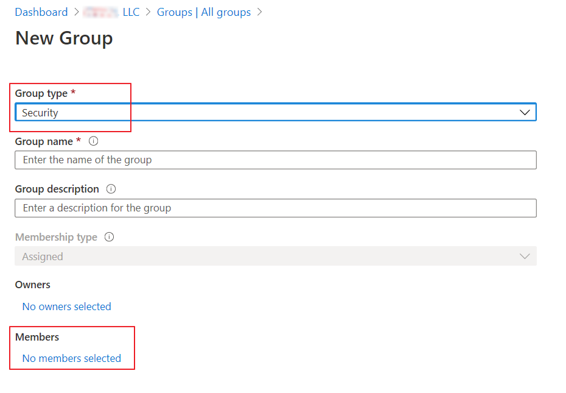

8.  Add members to the group you created. If you didn’t add members when you
    created the group, or if you need to add new members in the future, follow
    these steps.

9.  Go to the group list, search and find the group, select the group, and
    finally, click **Members**.

    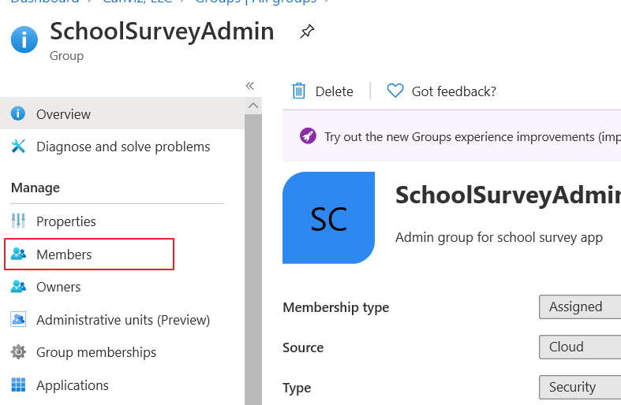

10.  Click **+ Add members**, then search for and select a member in your
    organization to add.

    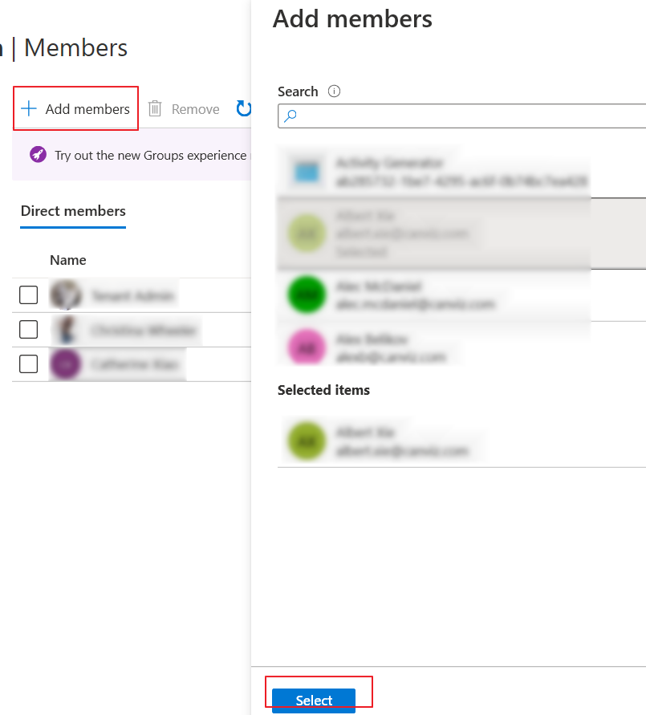

11.  Click **Select** to add them to the group.

---

 Step 02: Import the Power App
====================

Next, install the Power App in the target environment.

1.  In a web browser, open <https://make.powerapps.com> and go to **Apps**.

2.  Click **Import canvas app**.

    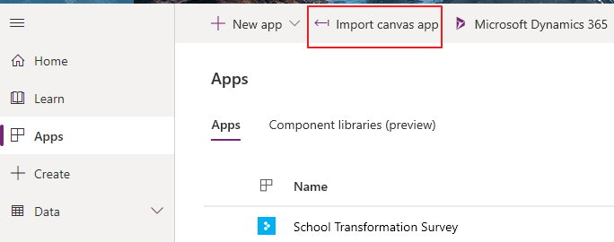

3.  Browse to the **SchoolTransformationSurvery.zip** file in the project files
    you downloaded and select it, then click **Upload**.

    

    After a few moments, you’ll see the import package screen that looks like
    the one show below. Make sure there are two items in the package, one is the
    Power App, the other is the Flow which the Power App uses.

    **NOTE:** Since this package is new to your environment, ensure the **IMPORT SETUP** values are set to **Create as new** for **BOTH** the
    Power App and Flow.

    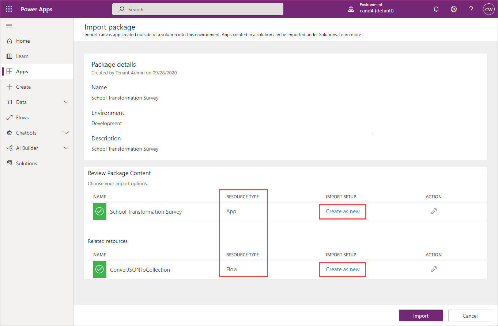

4.  Click **Import**.

    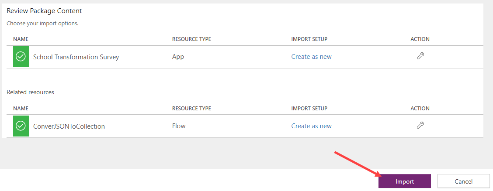

5. Wait until the import is done. On the success page, click **Open app** to
    open the Power App in Edit Mode.

    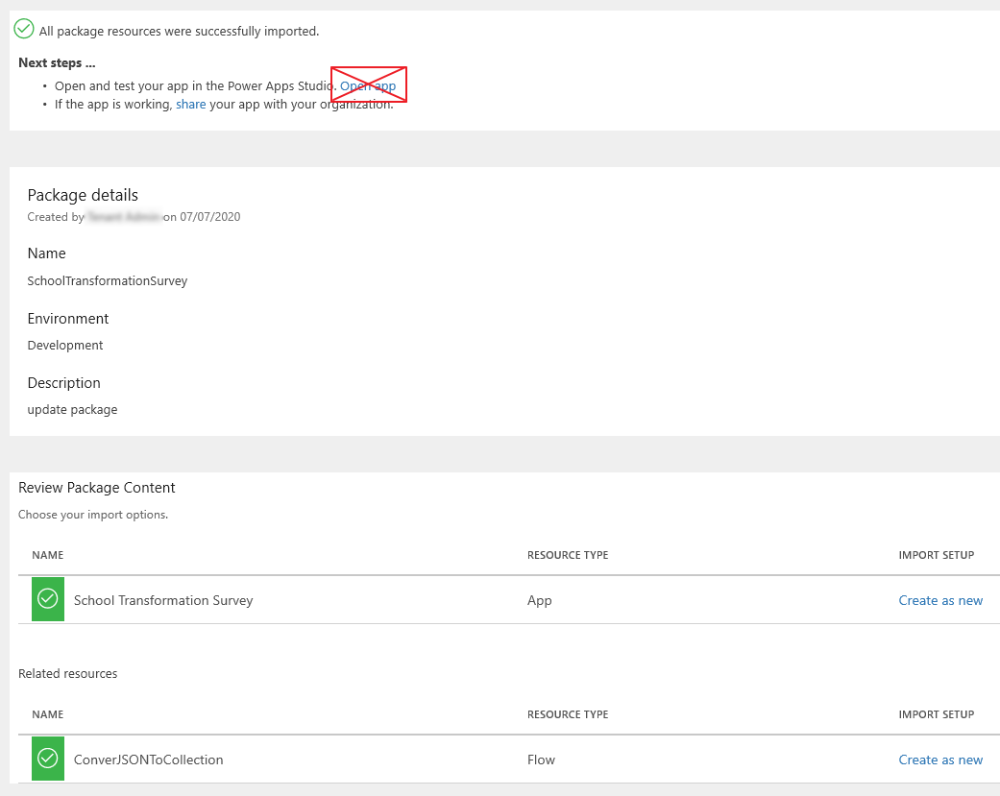

 Step 03: Configure Connector Permissions
===============================

Next you will need to configure the permissions for the connectors the Power
App uses to communicate with Azure Active Directory, Office 365 User Data, and
OneDrive for Business.

### More details about the connectors:

* **OneDrive for Business**: Connects to data source of the app in OneDrive folder
that was deployed when you ran the PowerShell script.
 
* **Azure AD**: Checks the membership of users in the Azure Active Directory
Security Group that was created when you ran the PowerShell script.

* **Office365Users**: Provides basic user profile information about the user.
---
You should see a dialog appear with an **Azure AD**, **Office 365 Users**, and **OneDrive for Business** connections. The **Azure AD** connection should have a **Sign in** button. 

1. Click **Sign in**.

    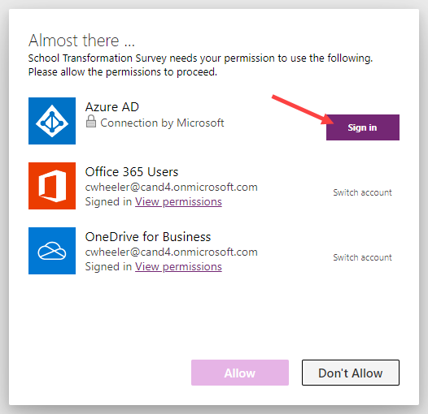

If this is the first time you have opened the app (it should be) you will now see
the following screen appear when you try to sign in.

2.  Select the **Consent on behalf of your organization checkbox**.

3.  Click **Accept**.

    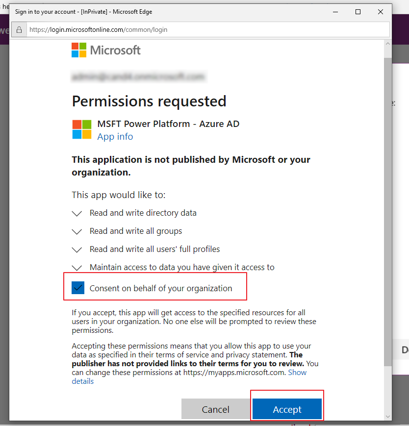

4.  Now go back to the screen that shows the 3 connectors and click **Allow**.

 Step 04: Configure the App
=================

Wait for a moment. Power Apps Studio will then open and the app will default to the edit interface.

In the next steps, you will be updating the connections used for the app.
> The reason this has to be done is because Power Apps does not have the ability to automatically adjust the location of the files stored in your OneDrive.

To update the data connections, follow the steps below:

1.  **Open Data sources panel** located in the left navigation bar.

    > There are multiple types of connections that
    the app uses, nine of them need to be **reconnected**, to the tables in the
    **Excel files** located in your OneDrive see below:

    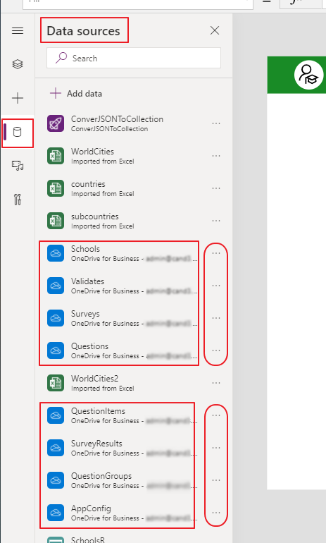

2.  **Remove** the nine **OneDrive** connected data sources showed in previous step by **clicking
    ellipses** for each one of the data connection and choose **Remove** in pop-up menu.

    After you remove the **OneDrive for Business** connections, you will see red error icons on your Power App. This is to be expected.

    Scroll down to the bottom of the connectors and you should see **OneDrive for Business**.

    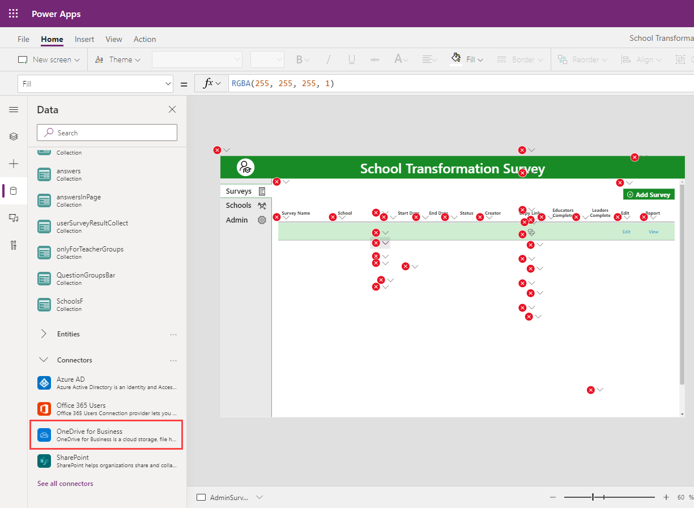

3.  Click on **OneDrive for Business** to start creating a new connection.

    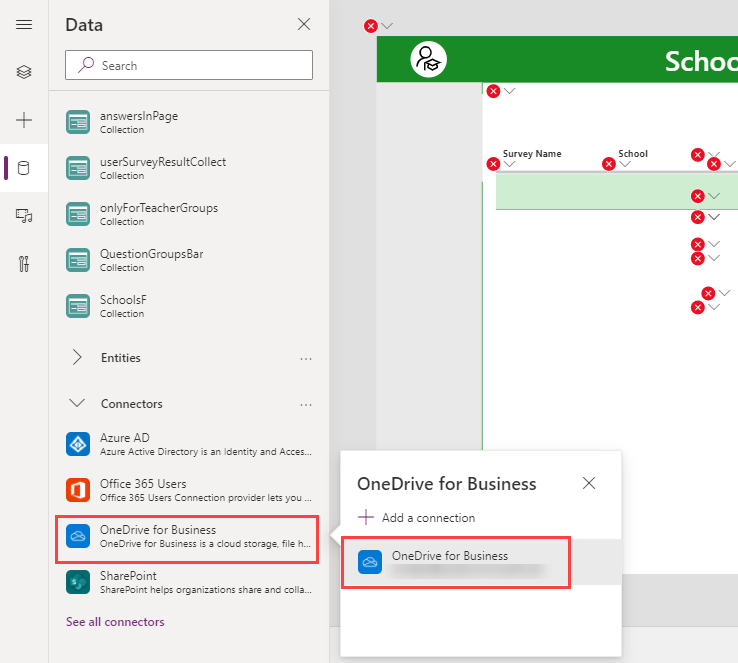

 4. **Click the connection** in the fly out window then a new window will pop in
    from the right. All files of OneDrive are listed in it. **Find the root folder**
    you created for the app. (SchoolSurvey)

    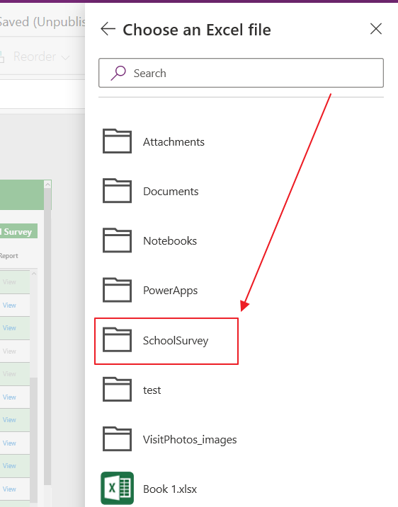

    Go to the folder, and select **"AppData"** in its folder list.

    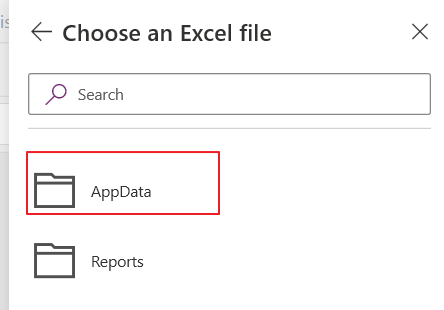

    Pictured below are the Excel files which hold the data sources for the app.

    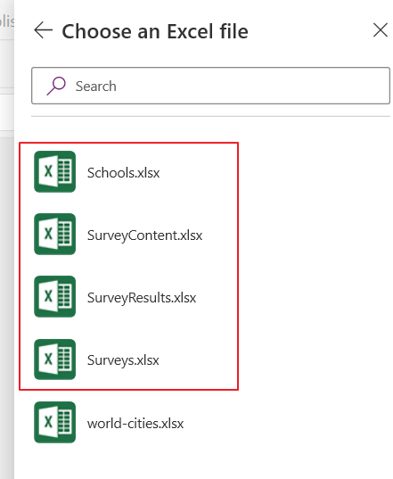

    You’ll need to add tables from those four Excels above to the app. For example,
    **select Schools.xlsx**.

    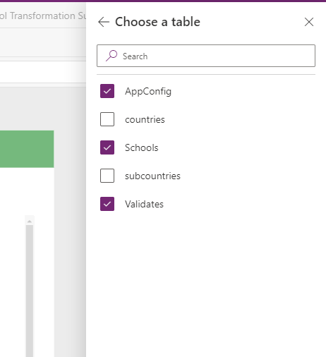

    **Choose table** "AppConfig"**,** "Schools", "Validates", then **Connect**. You
    have now added three of nine data connections.

    Follow the **same steps as above** and add other tables from corresponding Excel
    files. The list of relationship of tables and Excel files are listed below.

    | Excel File         | Tables                                   |
    |--------------------|------------------------------------------|
    | Schools.xlsx       | Schools, Validates, AppConfig            |
    | SurveyContent.xlsx | Questions, QuestionItems, QuestionGroups |
    | SurveyResults.xlsx | SurveyResults, GlobalSharedTime          |
    | Surveys.xlsx       | Surveys                                  |

5.  Open screen **Tree view** from left menus, select screen AppConfiguration.

    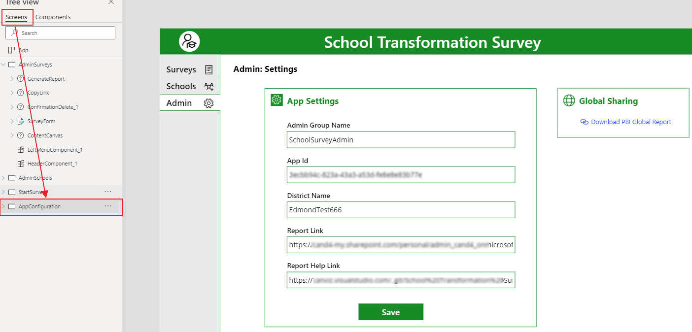

    On the right corner of PowerApps Editor, click Preview icon.

    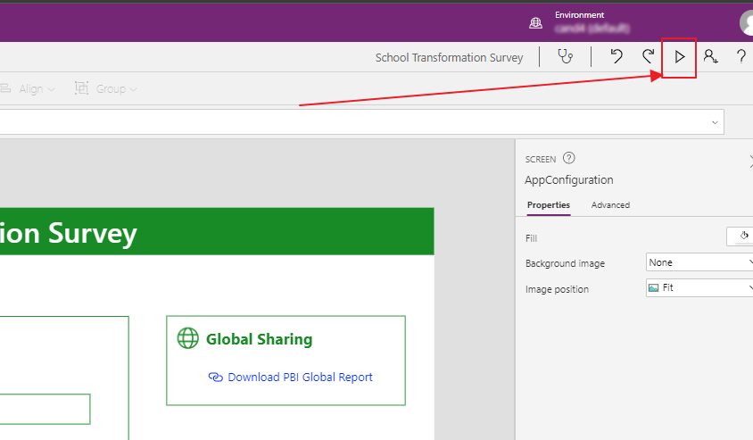

    Set values for fields in screen AppConfiguration.

    \#1: **Admin Group Name**: Input admin group name you created when execute the
    script automate.ps1.

    \#2: **App Id:** Go to Apps list of PowerApps in your tenant, find the app you
    are editing and **click Details**.

    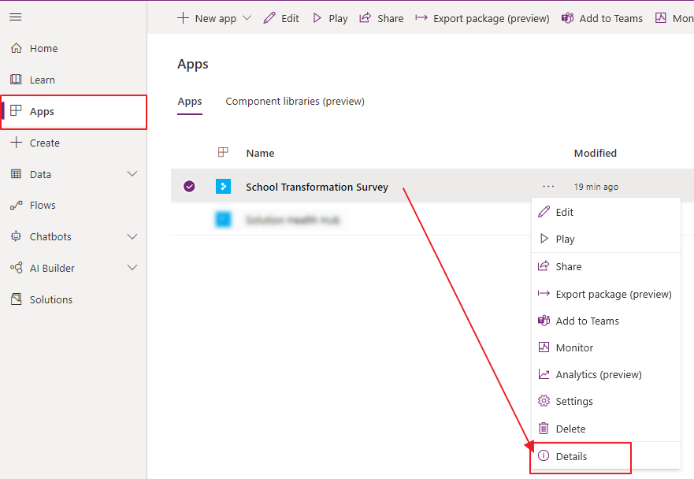

    The App Id is shown as follows. Copy and paste it into the App Id field.

    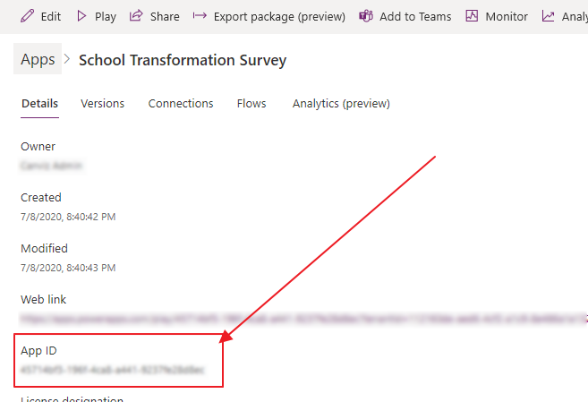

    \#3: **District Name:** Input the district name of school.

    \#4: **Report Link:** Go to OneDrive online, copy the link of Power BI template
    file, then paste the link in the field.

    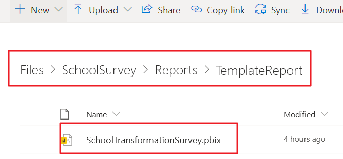

    \#5: **Report Help Link:** Copy and paste the link of [How to use Power
    BI](https://github.com/MicrosoftEduIndustry/STS/blob/master/Document/How%20to%20use%20PowerBI.md).

    Click **Save**, then exit preview mode.

 Step 05: Save and publish the App
========================

1.  Click **"File"** on the top menus in Edit interface of the app, then click
    **Save** on the left menu, optionally you can input version note for save
    and then **click Save**.

    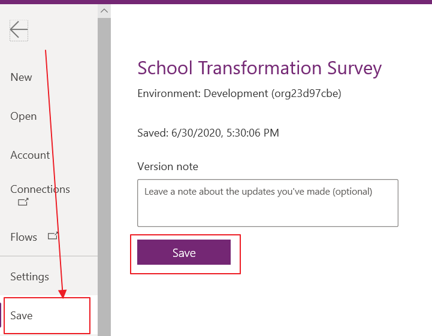

    Click **Publish**

    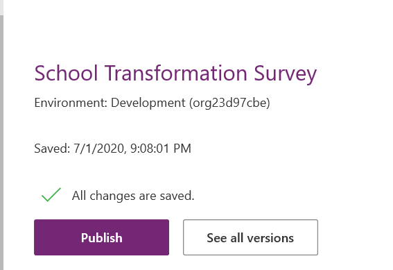

    Click **"Publish this version"** in the pop window.

    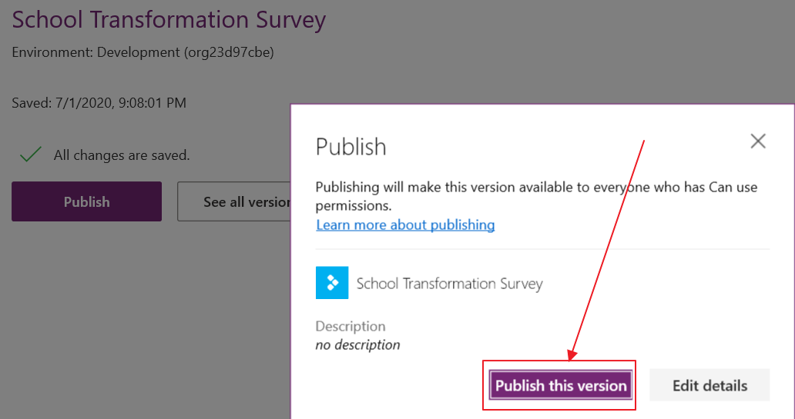

    The app is now ready to be used.

 Step 06: Create the custom connector
===========================

1.  Open <https://make.powerapps.com> , on the left menu list, collapse Data,
    Click Custom Connectors.

    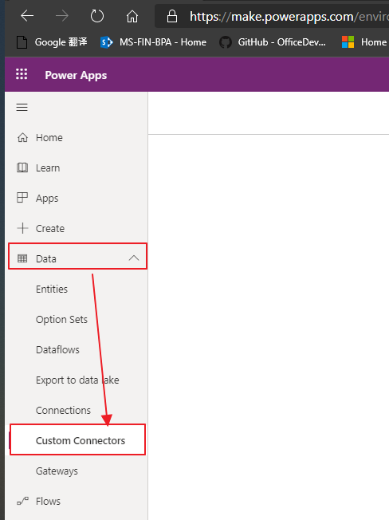

2.  In the right, collapse New custom connector, then choose Import an OpenAPI
    file.

    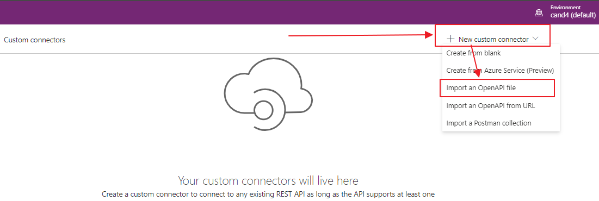

3.  In the pop window, input Connector name "UploadJSONToAzure" [DO NOT USE
    OTHER NAMES], click Import to choose "UploadJSONToAzure.swagger.json" from where you put it in your computer. Then click Continue.

    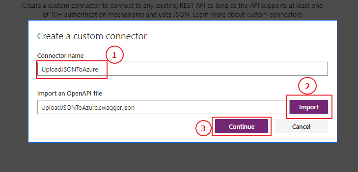

4.  In the new screen, click Create connector.

    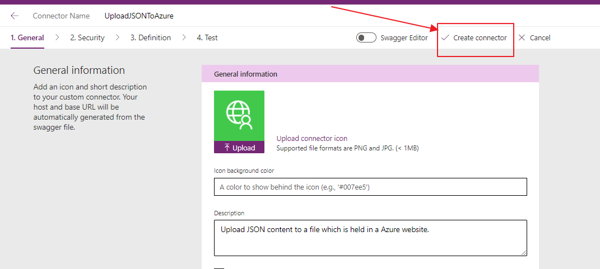

    Wait for a few minutes until you see the screen again, it’s done.

 Step 07: Create a connection to the custom connector
===========================================

1.  Still in <https://make.powerapps.com> , in the left menu list, go
    Data-\>Connections

    

2.  In connections page, click New connection.

    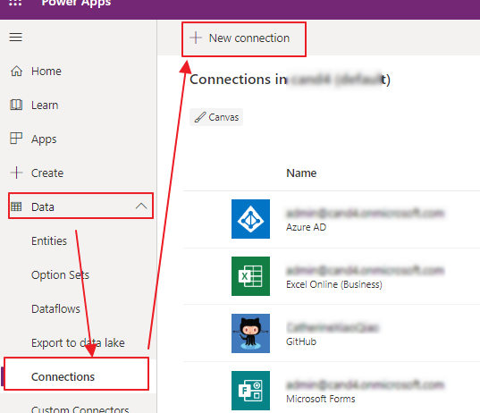

3.  In next page, input "UploadJSONToAzure" to search the connector you created
    in previous steps on top right corner. You’ll see it in list below. Then
    click the add icon in the right.

    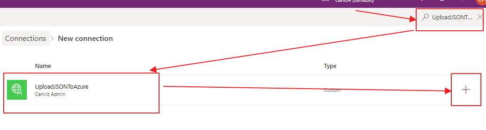

4.  In the pop window, click Create.

    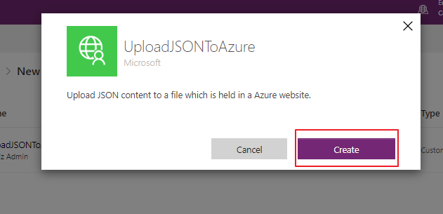

    Wait for a few seconds, you’ll be redirected to connections page and a new
    connection is added. Done.

 Step 08: Import the scheduled Flow
=========================

There are **two flow** in the app, one is an **Instant type**, the other is a
**Scheduled type**. The instant flow is packed into app’s package, the scheduled
one is not which means that you need to use the **zip package** to **import** it
into your environment.

1.  Open <https://flow.microsoft.com/> in a browser, sign in with you work
    account.

2.  Go to My Flows, **Click Import**.

    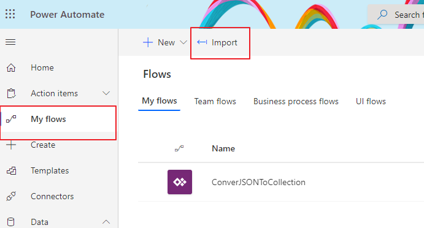

3.  **Select the flow file** "WriteSurveyToJSON.zip" from [project
    file](#prerequisites) , Upload.

    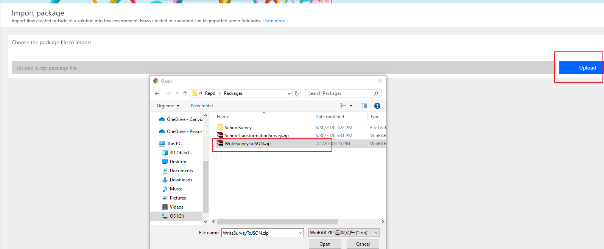

4.  Make sure it looks like below:

    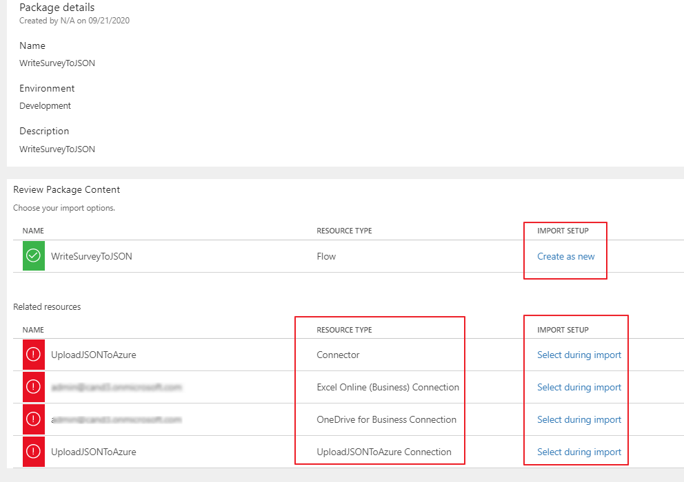

5.  **Update connections** for Related resources in this flow.

6.  Click **"Select during import"** on each item, if there are already created
    connections that exist on the right pop up then select a connection with the
    same type as showed in Related resources list. **Click Save.**

    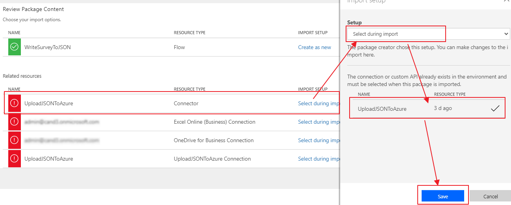

    After all related resources connected, it should look like below:

    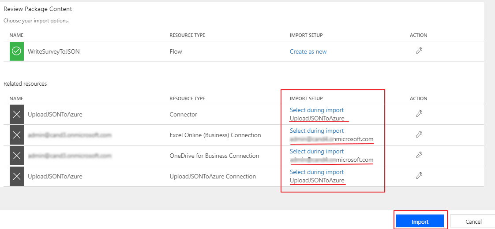

    If no connections, Click **"Create new"** in a new tab of the browser, then
    follow the steps to create a new one. Once completed go to the previous tab and
    **Click Refresh list**, you’ll see the new connection you created.

    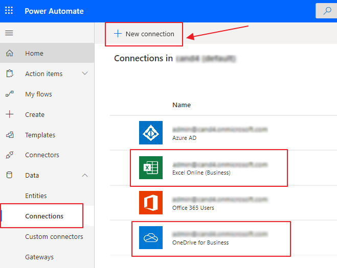

7.  You should now see the following. **Click Import**.

    

8.  **Open flow**

    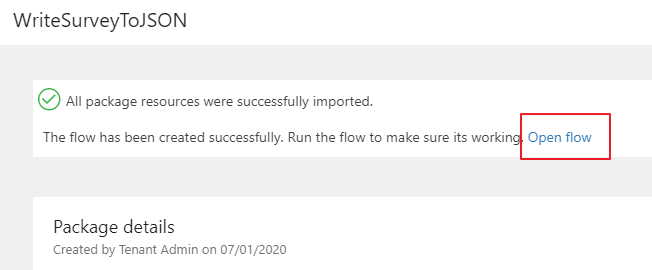

 Step 09: Configure the scheduled Flow
============================

On Flow interface

1.  **Set time zone** in Recurrence.

    Recurrence-\>Edit-\>Show Advanced options, choose a time zone.

2.  **Initialize variable** for reports folder

    Value: input the path of "Reports" folder in OneDrive, for example,
    "/SchoolSurvey/Reports/"

3.  **Get Surveys** (Remove invalid information first)

    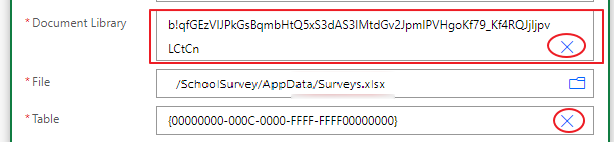

    **Document Library**: OneDrive

    **File:** Select the path where you put Surveys.xlsx

    **Table:** Select "Surveys"

    **NOTE**: if you cannot select a table in the dropdown list, re-select the path
    of Surveys.xlsx by clicking the file icon in File.

4.  Get Report Configuration

    **Document Library**: OneDrive

    **File**: Select the path where you put SurveyResults.xlsx

    **Table**: Select "ReportConfiguration"

5.  Get Calculation Configuration

    **Document Library**: OneDrive

    **File**: Select the path where you put SurveyResults.xlsx

    **Table**: Select "CalculationConfiguration"

6.  Apply to each survey-\> Get a School Data

    **Document Library**: OneDrive

    **File**: Select the path where you put Schools.xlsx

    **Table**: Select "Schools"

7.  Get the Data of current Survey

    **Document Library**: OneDrive

    **File**: Select the path where you put SurveyResults.xlsx

    **Table**: Select "SurveyResults"

8.  Check if AllGlobalData empty-\>If yes -\>Update a row

    **Document Library**: OneDrive

    **File**: Select the path where you put SurveyResults.xlsx

    **Table**: Select "GlobalSharedTime"

    **Key Column**: Id

    **Key Value**: 1

9.  Check if AllGlobalData empty-\>If no -\> Get file content

    **File**: Select the path where you put SampleReport.json, it should like:
    /SchoolSurvey/Reports/TemplateReport/SampleReport.json

    **NOTE**: Although you would see the path correctly put in box, you’ll have to
    re-point it again by clicking the file icon in right side of the box.

    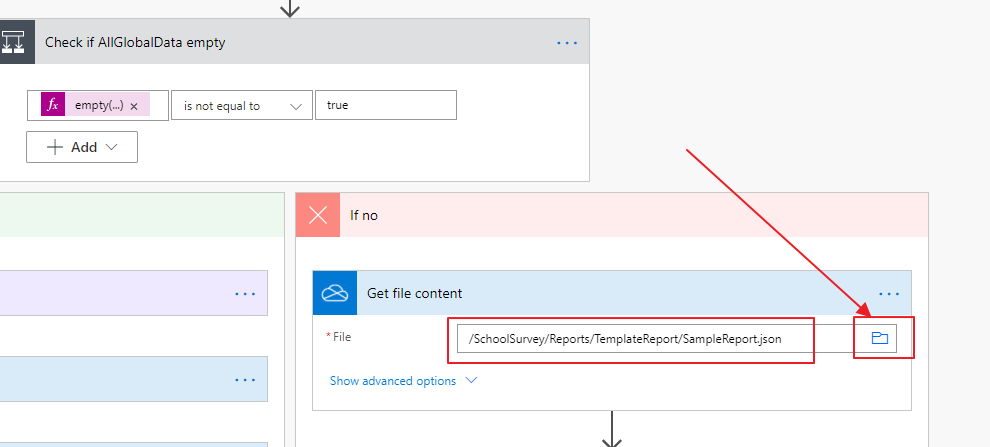

10. Check if AllGlobalData empty-\>If no -\>Update a row2
    
    **Document Library**: OneDrive

    **File**: Select the path where you put SurveyResults.xlsx

    **Table**: Select "GlobalSharedTime"

    **Key Column**: Id

    **Key Value**: 1

11. **Save and Test the flow**. Make sure the flow runs successfully.
    
    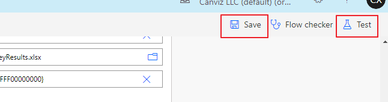

 Step 10: Share the app and it's data source
=================================

In order for the app to work, the app and the data source for the app's data needs to be shared. Sharing will grant users the necessary permissions for accessing the survey app and for the app to write the data to the Excel file. Proceed with the next steps to share the app and the AppData folder.

## Share the app

1.  In a web browser, open <https://make.powerapps.com> and go to **Apps**. Find **School Transformation Survey** > click on the **<em>ellipses</em> (...)** and then click **Share**. This will open the Share panel.

    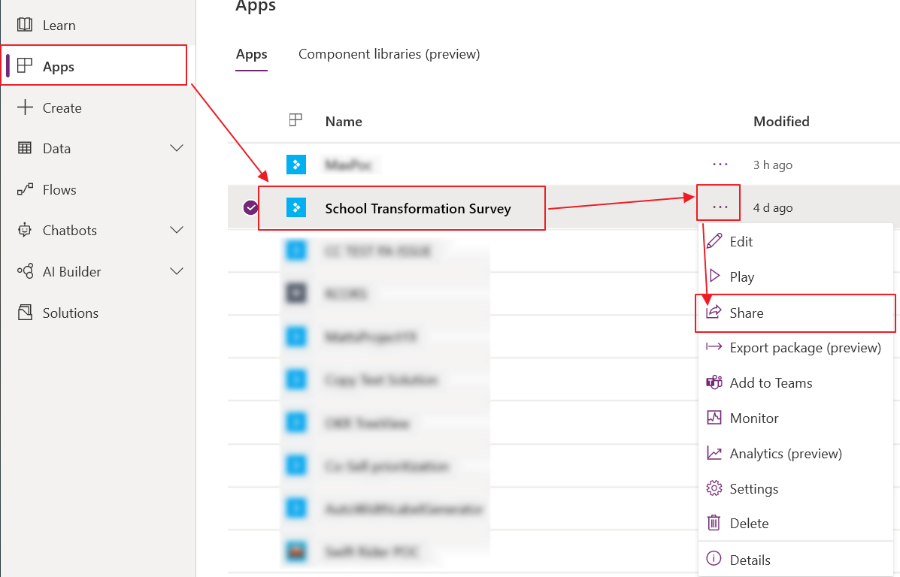

2. In the Share panel, search and choose a member of your tenant that will be filling out the survey. Continue to add additional members and then click
    **Share**.

    > **NOTE:** Ensure you do not set non IT staff as co-owners.

    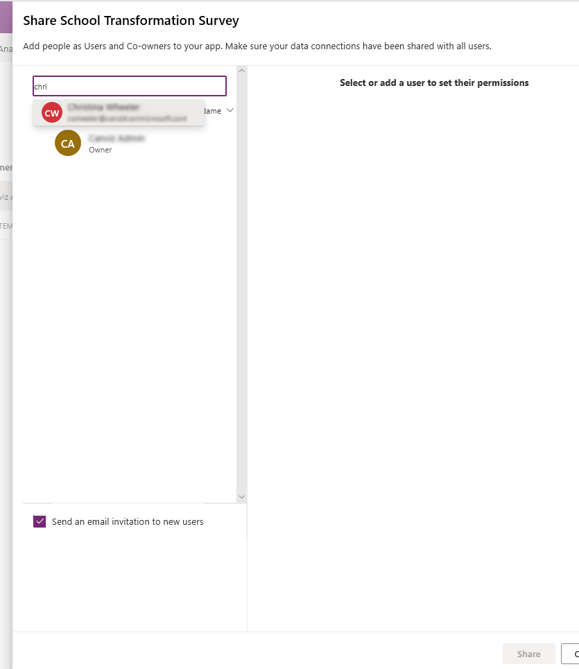

## Share data source of the app

1. In the browser, click on the Office 365 app launcher to open the Office 365 apps panel and click on **OneDrive**.

    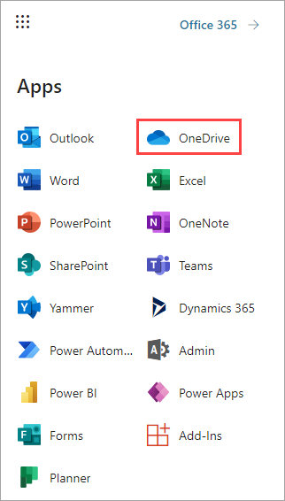
    
2. From OneDrive, open the **SchoolSurvey** folder. 

    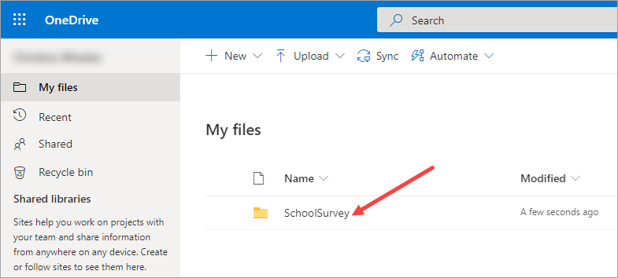
    
3. Hover over to the right of the **AppData** folder and click on the **Share** icon.

    
    
4. Click on the **right arrow** in **Send Link** window next to **Anyone with the link can edit**.

    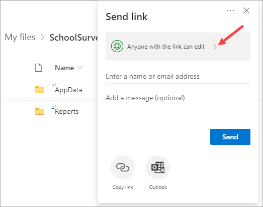

5.	Next choose **People in [your tenant] with the link**. Ensure **Allow editing** is checked and then click **Apply**. 

    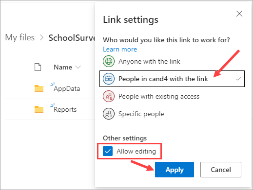
    
6. Search and choose members of your tenant you want to give the access to for filling out the survey.

    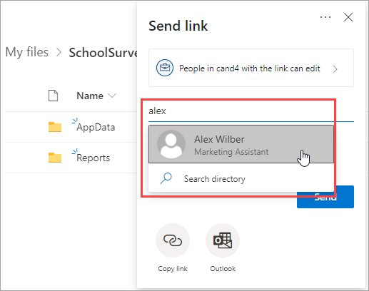
    
7. Continue to add additional members and add an optional message (such as explaining the access is for the Survey participation) then click **Send**.

    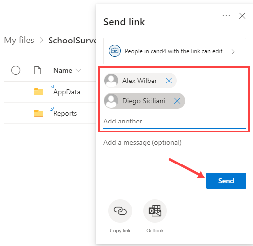
    

How to build add schools using the Excel sheet
==============================================

1.  Open the folder **AppData** in OneDrive which holds **Schools.xlsx**.

    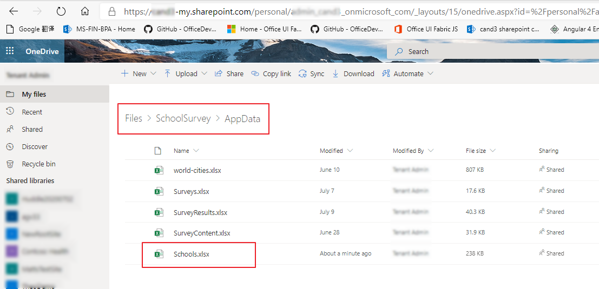

2.  Open Schools.xlsx, start to add/edit/delete records in the file.

    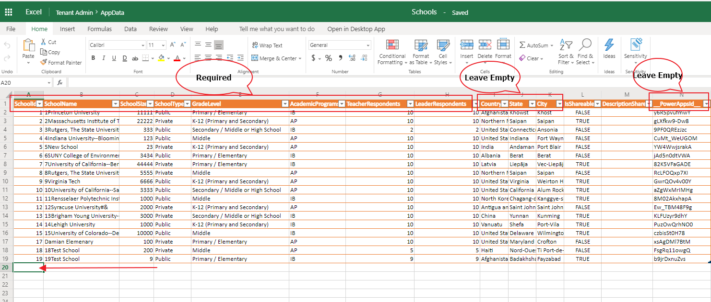
    
***
> ### NOTE:
> **Required fields:** These fields must be filled with valid values otherwise you’ll not be able to see them in the school list in the app.
> - **SchoolId**
>     - <em>**SchoolId** is a primary key field, please make sure there is no duplicate values.</em>
> - **SchoolName**
> - **SchoolSize**
> - **SchoolType**
> - **GradeLevel**
> - **AcademicPrograms**
> - **TeacherRespondents**
> - **LeaderRespondents**
> 
> 
> **Empty fields:** The empty fields are not required but the fields need to remain in the Excel file otherwise the app will break.
> - **Country**
> - **State**
> - **City**
> - **\_PowerAppsId\_**
> 
> <em>The **Country**, **State** and **City** fields were added for United States schools and the **\_PowerAppsId\_** field is a column the Power App uses and will automatically generate a value for.</em>
***
3.  **Save** and check the data.

    Excel online can automatically save the data you modified. Make sure the tag
    changed from Saving to Saved.

    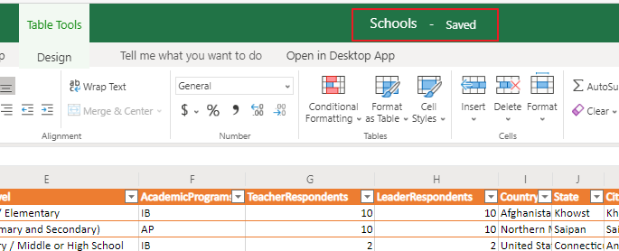

4. Close the excel file, open the app by admin account and navigate to Schools. You’ll see the data you added.

    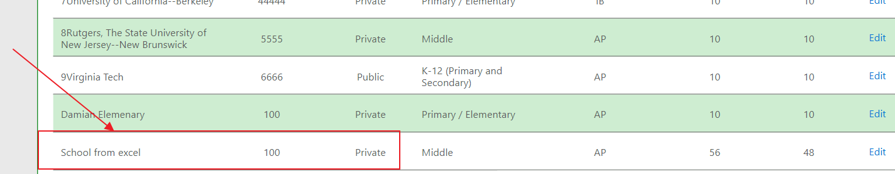
    

 Optional Step: How to embed the PowerBI report into Teams
==========================================

1.  Open your Microsoft Teams app, click Teams or Chat from left tab bar.

    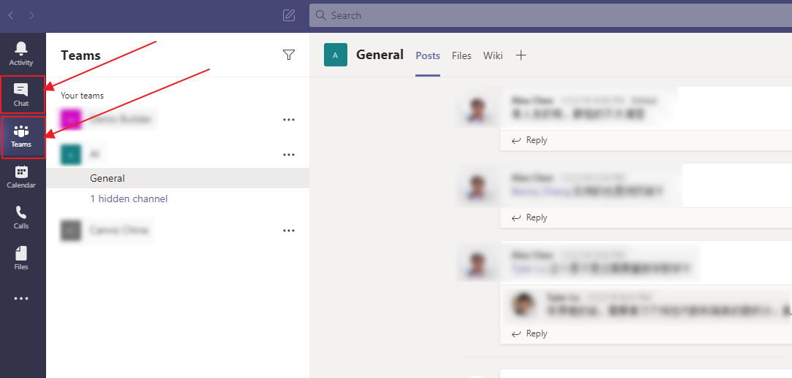

2.  In a team screen or a chat screen, click add icon.

    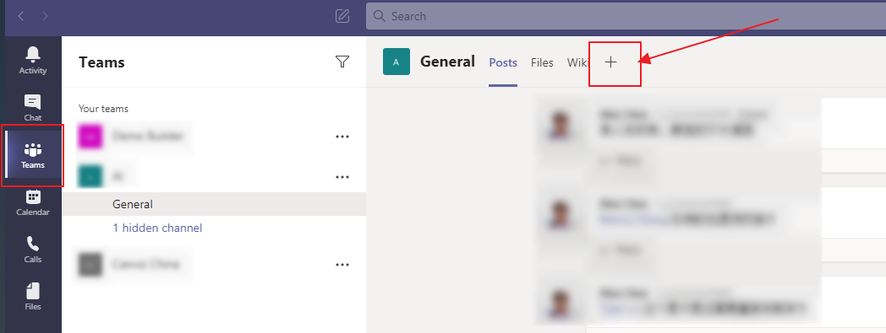

3.  In the prompt window, search then choose Power BI,

    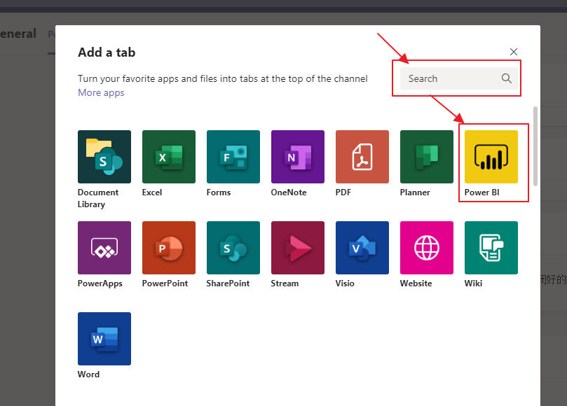

4.  In the Power BI prompt window, input a name for the tab you are adding,
    collapse the workspace which holds the report you are adding, then choose
    the report, click save.

    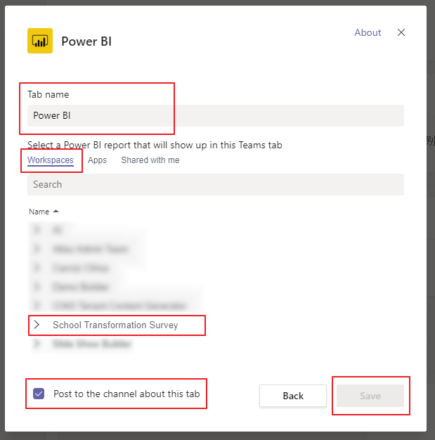

5.  After clicking Save, you are gonna see a new tab added, and the report
    showed below the tab.

    Note: Make sure members in the team or the chat have permissions to access
    the report.

    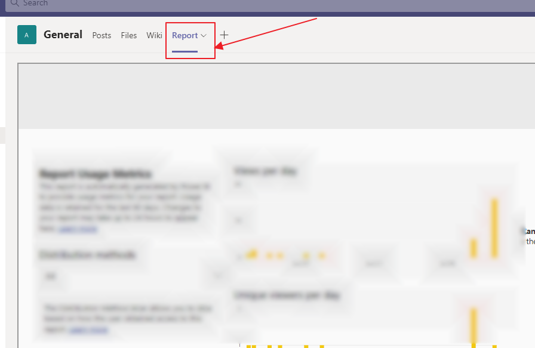
