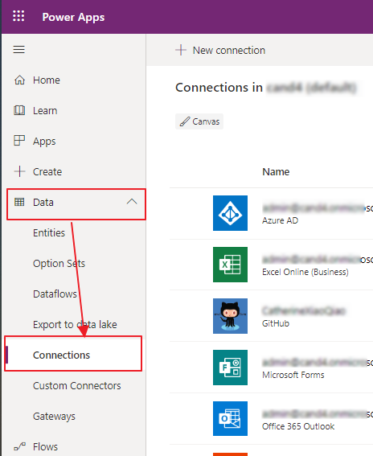
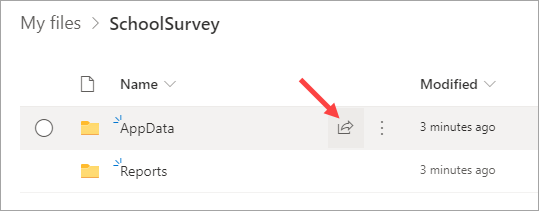

Installation Click through Demo
=============
After you have all the solution files downloaded, you can use this guided demo to help with the steps: 
[Installation Demo](https://nam06.safelinks.protection.outlook.com/?url=https%3A%2F%2Fdemobuilderwebcpptxz.blob.core.windows.net%2Fschool-transformation-survey-deployment-guide%2Fstartdemo.html%3Fot%3Dfalse%26lan%3D%26guidemodeenabled%3Dfalse%26audioenabled%3Dfalse&data=02%7C01%7Cv-cwheel%40microsoft.com%7C53aba7e7cd8b4c1f032808d866602f43%7C72f988bf86f141af91ab2d7cd011db47%7C1%7C0%7C637371910584893550&sdata=JwA3FcYJwYBDPZO5pWDfDgENw7JDAODT0kQbVPxXXqQ%3D&reserved=0)

Prerequisites
=============

## M365 Accounts and Subcriptions

1.  A Microsoft 365 account with the following services:

    -   SharePoint Client Component(To install in your computer)

    -   Windows PowerShell (Installed by default in Windows)

    -   OneDrive for Business

    -   Power Apps

    -   Power BI (Free for personal workspace or Pro for shared workspaces and
        dashboards)

    -   Power BI Desktop installed

2.  An Azure subscription
## Solution Files
3.  Download the following items:

    | **Type** | **Name**                                                                                                                                                   | **Description**                                                                                                                            |
    |----------|------------------------------------------------------------------------------------------------------------------------------------------------------------|--------------------------------------------------------------------------------------------------------------------------------------------|
    | Zip      | [OneDriveContainer.zip](https://github.com/MicrosoftEduIndustry/STS/raw/master/Packages/OneDriveContainer.zip)                   | Download and extract zipped files: The SchoolSurvey folder and all it's contents will need to be uploaded to OneDrive.                     |
    | Zip      | [SchoolTransformationSurvey.zip](https://github.com/MicrosoftEduIndustry/STS/raw/master/Packages/SchoolTransformationSurvey.zip) | Download and leave zipped: Contains an app package and an Instant Flow which will need to be imported and configured in Power Automate.    |
    | Zip      | [WriteSurveyToJSON.zip](https://github.com/MicrosoftEduIndustry/STS/raw/master/Packages/WriteSurveyToJSON.zip)                   | Download and leave zipped: Contains a Scheduled Flow for the app that will need to be imported and configured in Power Automate.           |
    | Script   | [automate.ps1](https://github.com/MicrosoftEduIndustry/STS/raw/master/Packages/automate.ps1)                                     | Power Shell script which is executed to complete uploading files in OneDriveContainer to OneDrive and creating security group for the app. |
    | Script   | [UploadJSONToAzure.swagger.json](https://github.com/MicrosoftEduIndustry/STS/raw/master/Packages/UploadJSONToAzure.swagger.json) | A json file which will be used for creating a custom connector for uploading Global shared data to your Azure website.                     |

Execute PowerShell script
=========================

Follow the steps below to upload the necessary files to OneDrive and create a
security group for the app.

>   **NOTE:** Ensure you unzipped the OneDriveContainer.zip folder you
>   downloaded in the prerequisites solution files steps.

1.  Download [SharePoint Online Client
    Components](https://www.microsoft.com/en-us/download/details.aspx?id=42038).
    In the download prompt page, choose a one you want then download the file.

    

2.  Run the installer you downloaded. Once you have installed the downloaded
    setup, you can proceed next steps.

3.  Open "automate.ps1" using Notepad or VS Code(recommend).

4.  Replace values of variables in the beginning of the script file which are in
    between "Initialize variables start" and "Initialize variables end". Here is
    an example for these values.

    | Variable         | Value                                                              |
    |------------------|--------------------------------------------------------------------|
    | \$LocalFolder    | C:\\\\Package\\OneDriveContainer                                   |
    | \$AdminAccount   | admin\@dodo.onmicrosoft.com                                        |
    | \$AdminPass      | 12345678                                                           |
    | \$OneDriveURL    | https://dodo-my.sharepoint.com/personal/admin_dodo_onmicrosoft_com |
    | \$GroupName      | SchoolSurveyAdmin                                                  |
    | \$MembersInGroup | <abc@dodo.onmicrosoft.com>, <edf@dodo.onmicrosoft.com>             |

5.  Save the script file. Find and right click windows powershell in your
    computer, choosing Run as administrator.

6.  Redirect to the folder which you put automate.ps1 using cd command.

    

    Then execute the script file by inputting .\\automate.ps1

    

    During the script executing, you may encounter information like below:

    

    

    For both, enter Y or y to proceed.

    **NOTE:**

    You may encounter this error as below when executing the script.

    

    This is a security measure in PowerShell to prevent malicious scripts from
    running and potentially harming the system. Of course the script you are running
    will not harm your system. To fix it, please execute the script below to change
    the execution policy in PowerShell.

    **Set-ExecutionPolicy RemoteSigned -Scope LocalMachine**

    

7.  To check scripts work fine, Login to OneDrive check if the files have
    uploaded under root directory and the files structure is same with in
    OneDriveContainer(NOT including itself).

8.  Login to Azure, go to Azure Active Directory -\>Groups check if the group
    has been created and its members added.

    

    And if you want to add more members to the group, go into the group detail
    page.

    

Import the Power App
====================

Next, install the Power App in the target environment.

1.  In a web browser, open <https://make.powerapps.com> and go to **Apps**.

2.  Click **Import canvas app**.

    

3.  Browse to the **SchoolTransformationSurvery.zip** file in the project files
    you downloaded and select it, then click **Upload**.

    

    After a few moments, you’ll see the import package screen that looks like
    the one show below. Make sure there are two items in the package, one is the
    Power App, the other is the Flow which the Power App uses.

    

    Since this package is new to your environment, the **IMPORT SETUP** value
    needs to be changed from **Update** to **Create as new** for **BOTH** the
    Power App and Flow.

4.  In the App row in the list, in the **IMPORT SETUP** column, click
    **Update**. Then, in the popup panel, select **Create as new** and click
    **Save**. (See the screenshot below for more details.)

5.  Now do the exact same thing in the Flow row in the list, in the **IMPORT
    SETUP** column, click **Update**. Then, in the popup panel, select **Create
    as new** and click **Save**.

    **Note:** Make sure both the App and Flow items in the package have the
    IMPORT STEP column value Create as new.

    

    Now the **Import** bottom should be enabled.

6.  Click **Import**.

    

    Wait until the import is done. On the success page, click **Open app** to
    open the Power App in Edit Mode.

    

Configure Connector Permissions
===============================

Next, you will need to configure the permissions for the connectors the Power
App uses to communicate with Azure Active Directory, Office 365 User Data, and
OneDrive for Business.

More details about the connectors:

**OneDrive for Business**: Connects to data source of the app in OneDrive folder
that was deployed when you ran the PowerShell script.

**Azure AD**: Checks the membership of users in the Azure Active Directory
Security Group that was created when you ran the PowerShell script.

**Office365Users**: Provides basic user profile information about the user.

You will see this screen appear.

If this is the first time you have opened the app (it should be) you will see
the following screen appear when you try to sign in.

1.  Select the **Consent on behalf of your organization checkbox**.

2.  Click **Accept**.

    

3.  Then, back in the screen that shows the 3 connectors, click **Allow**.

Configure the App
=================

Wait for a moments and you’ll see the edit interface.

1.  **Open Data sources panel**. There are multiple types of connections that
    the app uses, nine of them need to be **reconnected**, to the tables in the
    **Excel files** located in your OneDrive see below:

    

2.  **Remove** the nine data sources showed in previous step by **clicking
    ellipses** behind those nine, choose "Remove" in pop menu.

3.  Connect to OneDrive from Data sources panel under **"Connectors"** group,
    find **OneDrive for Business** from the group.

    **Click this connector**. The connection probably already exists, you just
    need to make sure the account in it is you logged in. If it is not you or
    there is no connection, click **"Add a connection"** and follow steps to add
    a new one.

    

    **Click the connection** in the fly out window then a new window will pop in
    from the right. All files of OneDrive are listed in it. **Find the root folder**
    you created for the app. (SchoolSurvey)

    

    Go to the folder, and select **"AppData"** in its folder list.

    

    Pictured below are the Excel files which hold the data sources for the app.

    

    You’ll need to add tables from those four Excels above to the app. For example,
    **select Schools.xlsx**.

    

    **Choose table** "AppConfig"**,** "Schools", "Validates", then **Connect**. You
    have now added three of nine data connections.

    Follow the **same steps as above** and add other tables from corresponding Excel
    files. The list of relationship of tables and Excel files are listed below.

    | Excel File         | Tables                                   |
    |--------------------|------------------------------------------|
    | Schools.xlsx       | Schools, Validates, AppConfig            |
    | SurveyContent.xlsx | Questions, QuestionItems, QuestionGroups |
    | SurveyResults.xlsx | SurveyResults, GlobalSharedTime          |
    | Surveys.xlsx       | Surveys                                  |

4.  Open screen **Tree view** from left menus, select screen AppConfiguration.

    

    On the right corner of PowerApps Editor, click Preview icon.

    

    Set values for fields in screen AppConfiguration.

    \#1: **Admin Group Name**: Input admin group name you created when execute the
    script automate.ps1.

    \#2: **App Id:** Go to Apps list of PowerApps in your tenant, find the app you
    are editing and **click Details**.

    

    The App Id is shown as follows. Copy and paste it into the App Id field.

    

    \#3: **District Name:** Input the district name of school.

    \#4: **Report Link:** Go to OneDrive online, copy the link of Power BI template
    file, then paste the link in the field.

    

    \#5: **Report Help Link:** Copy and paste the link of [How to use Power
    BI](https://github.com/MicrosoftEduIndustry/STS/blob/master/Document/How%20to%20use%20PowerBI.md).

    Click **Save**, then exit preview mode.

Save and publish the App
========================

1.  Click **"File"** on the top menus in Edit interface of the app, then click
    **Save** on the left menu, optionally you can input version note for save
    and then **click Save**.

    

    Click **Publish**

    

    Click **"Publish this version"** in the pop window.

    

    The app is now ready to be used.

Create the custom connector
===========================

1.  Open <https://make.powerapps.com> , on the left menu list, collapse Data,
    Click Custom Connectors.

    

2.  In the right, collapse New custom connector, then choose Import an OpenAPI
    file.

    

3.  In the pop window, input Connector name "UploadJSONToAzure" [DO NOT USE
    OTHER NAMES], click Import to choose "UploadJSONToAzure.swagger.json" from where you put it in your computer. Then click Continue.

    

4.  In the new screen, click Create connector.

    

    Wait for a few minutes until you see the screen again, it’s done.

Create a connection to the custom connector
===========================================

1.  Still in <https://make.powerapps.com> , in the left menu list, go
    Data-\>Connections

    

2.  In connections page, click New connection.

    

3.  In next page, input "UploadJSONToAzure" to search the connector you created
    in previous steps on top right corner. You’ll see it in list below. Then
    click the add icon in the right.

    

4.  In the pop window, click Create.

    

    Wait for a few seconds, you’ll be redirected to connections page and a new
    connection is added. Done.

Import the scheduled Flow
=========================

There are **two flow** in the app, one is an **Instant type**, the other is a
**Scheduled type**. The instant flow is packed into app’s package, the scheduled
one is not which means that you need to use the **zip package** to **import** it
into your environment.

1.  Open <https://flow.microsoft.com/> in a browser, sign in with you work
    account.

2.  Go to My Flows, **Click Import**.

    

3.  **Select the flow file** "WriteSurveyToJSON.zip" from [project
    file](#prerequisites) , Upload.

    

4.  Make sure it looks like below:

    

5.  **Update connections** for Related resources in this flow.

6.  Click **"Select during import"** on each item, if there are already created
    connections that exist on the right pop up then select a connection with the
    same type as showed in Related resources list. **Click Save.**

    

    After all related resources connected, it should look like below:

    

    If no connections, Click **"Create new"** in a new tab of the browser, then
    follow the steps to create a new one. Once completed go to the previous tab and
    **Click Refresh list**, you’ll see the new connection you created.

    

7.  You should now see the following. **Click Import**.

    

8.  **Open flow**

    

Configure the scheduled Flow
============================

On Flow interface

1.  **Set time zone** in Recurrence.

    Recurrence-\>Edit-\>Show Advanced options, choose a time zone.

2.  **Initialize variable** for reports folder

    Value: input the path of "Reports" folder in OneDrive, for example,
    "/SchoolSurvey/Reports/"

3.  **Get Surveys** (Remove invalid information first)

    

    **Document Library**: OneDrive

    **File:** Select the path where you put Surveys.xlsx

    **Table:** Select "Surveys"

    **NOTE**: if you cannot select a table in the dropdown list, re-select the path
    of Surveys.xlsx by clicking the file icon in File.

4.  Get Report Configuration

    **Document Library**: OneDrive

    **File**: Select the path where you put SurveyResults.xlsx

    **Table**: Select "ReportConfiguration"

5.  Get Calculation Configuration

    **Document Library**: OneDrive

    **File**: Select the path where you put SurveyResults.xlsx

    **Table**: Select "CalculationConfiguration"

6.  Apply to each survey-\> Get a School Data

    **Document Library**: OneDrive

    **File**: Select the path where you put Schools.xlsx

    **Table**: Select "Schools"

7.  Get the Data of current Survey

    **Document Library**: OneDrive

    **File**: Select the path where you put SurveyResults.xlsx

    **Table**: Select "SurveyResults"

8.  Check if AllGlobalData empty-\>If yes -\>Update a row

    **Document Library**: OneDrive

    **File**: Select the path where you put SurveyResults.xlsx

    **Table**: Select "GlobalSharedTime"

    **Key Column**: Id

    **Key Value**: 1

9.  Check if AllGlobalData empty-\>If no -\> Get file content

    **File**: Select the path where you put SampleReport.json, it should like:
    /SchoolSurvey/Reports/TemplateReport/SampleReport.json

    **NOTE**: Although you would see the path correctly put in box, you’ll have to
    re-point it again by clicking the file icon in right side of the box.

    

10. Check if AllGlobalData empty-\>If no -\>Update a row2
    
    **Document Library**: OneDrive

    **File**: Select the path where you put SurveyResults.xlsx

    **Table**: Select "GlobalSharedTime"

    **Key Column**: Id

    **Key Value**: 1

11. **Save and Test the flow**. Make sure the flow runs successfully.
    
    

Share the app and it's data source
=================================

In order for the app to work, the app and the data source for the app's data needs to be shared. Sharing will grant users the necessary permissions for accessing the survey app and for the app to write the data to the Excel file. Proceed with the next steps to share the app and share the AppData folder.

## Share the app

1.  In a web browser, open <https://make.powerapps.com> and go to **Apps**. Find **School Transformation Survey** > click on the **<em>ellipses</em> (...)** and then click **Share**. This will open the Share panel.

    

2. In the Share panel, search and choose a member of your tenant that will be filling out the survey. Continue to add additional members and then click
    **Share**.

    > **NOTE:** Ensure you do not set non IT staff as co-owners.

    

## Share data source of the app

1. In the browser, click on the Office 365 app launcher to open the Office 365 apps panel and click on **OneDrive**.

    
    
2. From OneDrive, open the **SchoolSurvey** folder. 

    
    
3. Hover over to the right of the **AppData** folder and click on the **Share** icon.

    
    
4. Click on the **right arrow** in **Send Link** window next to **Anyone with the link can edit**.

    

5.	Next choose **People in [your tenant] with the link**. Ensure **Allow editing** is checked and then click **Apply**. 

    
    
6. Search and choose members of your tenant you want to give the access to for filling out the survey.

    
    
7. Continue to add additional members and add an optional message (such as explaining the access is for the Survey participation) then click **Send**.

    
    

How to build add schools using the Excel sheet
==============================================

1.  Open the folder **AppData** in OneDrive which holds **Schools.xlsx**.

    

2.  Open Schools.xlsx, start to add/edit/delete records in the file.

    

    **Note:**

    Required fields: **SchoolId, SchoolName, SchoolSize, SchoolType, GradeLevel,
    AcademicPrograms, TeacherRespondents, LeaderRespondents**. Please make these
    fields filled and have valid values, otherwise you’ll not be able to see
    them in the school list in the app.

    **SchoolId** is a primary key field, please make sure there is no duplicate
    values.

    Empty fields: **Country, State, City, \_PowerAppsId\_**.

    Although you can edit/delete school data, but you’d better not do it from
    Excel, because in some cases school can not be edited or deleted.

3.  Save and check the data.

    Excel online can automatically save the data you modified. Make sure the tag
    change from Saving to Saved.

    

    Close the excel file, open the app by admin account and navigate to Schools.
    You’ll see the data you added.

    

How to embed the PowerBI report into Teams
==========================================

1.  Open your Microsoft Teams app, click Teams or Chat from left tab bar.

    

2.  In a team screen or a chat screen, click add icon.

    

3.  In the prompt window, search then choose Power BI,

    

4.  In the Power BI prompt window, input a name for the tab you are adding,
    collapse the workspace which holds the report you are adding, then choose
    the report, click save.

    

5.  After clicking Save, you are gonna see a new tab added, and the report
    showed below the tab.

    Note: Make sure members in the team or the chat have permissions to access
    the report.

    
